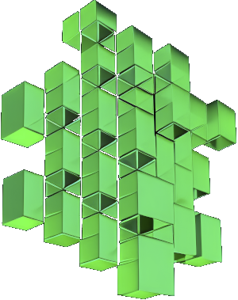

# Mantella 
> Bring Skyrim NPCs to life with AI

Mantella is a Skyrim mod which allows you to naturally speak to NPCs using [Whisper](https://github.com/openai/whisper) (speech-to-text), LLMs (text generation), and [xVASynth](https://github.com/DanRuta/xVA-Synth) (text-to-speech).  

Click below or [here](https://youtu.be/FLmbd48r2Wo?si=QLe2_E1CogpxlaS1) to see the full trailer:

# Installation
See [art-from-the-machine.github.io/Mantella](https://art-from-the-machine.github.io/Mantella/)

# Issues Q&A
See [art-from-the-machine.github.io/Mantella/pages/issues_qna.html](https://art-from-the-machine.github.io/Mantella/pages/issues_qna.html)

# Skyrim
See [art-from-the-machine.github.io/Mantella/pages/installation.html#skyrim](https://art-from-the-machine.github.io/Mantella/pages/installation.html#skyrim)

# Contribute
The source code for Mantella is included in this repo. Here are the quick steps to get set up:

1. Clone the repo to your machine
2. Create a virtual environment via `py -3.11 -m venv MantellaEnv` in your console (Mantella requires Python 3.11)
3. Start the environment in your console (`.\MantellaEnv\Scripts\Activate`)
4. Install the required packages via `pip install -r requirements.txt`
5. Create a file called `GPT_SECRET_KEY.txt` and paste your secret key in this file
6. Set up your paths / any other required settings in the `config.ini`
7. Run Mantella via `main.py` in the parent directory

If you have any trouble in getting the repo set up, please reach out on [Discord](https://discord.gg/Q4BJAdtGUE)!

The source code for the Mantella spell mod can be found [here](https://github.com/art-from-the-machine/Mantella-Spell). Updates made on one repo are often intertwined with the other, so it is best to ensure you have the latest versions of each when developing.

# Attributions
Mantella uses material from the "[Skyrim: Characters](https://elderscrolls.fandom.com/wiki/Category:Skyrim:_Characters)" articles on the [Elder Scrolls wiki](https://elderscrolls.fandom.com/wiki/The_Elder_Scrolls_Wiki) at [Fandom](https://www.fandom.com/) and is licensed under the [Creative Commons Attribution-Share Alike License](https://creativecommons.org/licenses/by-sa/3.0/).
