# Skyrim Installation
## Quick Start
1. Download and install the [required mods](#required-skyrim-mods) using your mod manager.
2. Open the folder where your mod manager installed Mantella: 

	<details>
	<summary><b>Mod Organizer 2 Users</b></summary>  

	You can find your Mantella mod folder by right clicking the Mantella mod in the Mod Organizer 2 UI and selecting “Open in Explorer”:  

	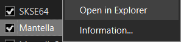  
	</details>
	<details>
	<summary><b>Vortex Users</b></summary>  

	You can find your Mantella mod folder by going to `\Data\Mantella` from your Skyrim game folder.  
	Eg `C:\Games\Steam\steamapps\common\Skyrim Special Edition\Data\Mantella`.
	</details>

3. Create a free account with <a href="https://openrouter.ai/sign-up" target="_blank" rel="noopener noreferrer">OpenRouter</a>. Go to the "Keys" tab in the top right corner and generate a new key. Save the key value to the `GPT_SECRET_KEY.txt` file in your Mantella folder found in step 2.

4. Launch Skyrim. Mantella will open a window automatically when Skyrim is launched and will say "Waiting for player to select an NPC..." when it is ready (this might take a few minutes when launched for the first time). When you start the game, the Mantella spell will be added to your inventory. Cast this spell on an NPC to start a conversation.

```{admonition} Note
:class: seealso

By default, Mantella is configured to provide a balanced out-of-the-box experience. To learn how to prioritize real-time responses, see <a href="./real_time_npcs.html">here</a>.
```

<div style="text-align: center;">
	<iframe width="560" height="315" src="https://www.youtube.com/embed/0YlccdAJIDg?si=KTVDapemtDFV5TvN" title="Mantella Installation Tutorial" frameborder="0" allow="accelerometer; clipboard-write; encrypted-media; gyroscope; picture-in-picture; web-share" referrerpolicy="strict-origin-when-cross-origin" allowfullscreen></iframe>  
</div>  

<details>
<summary><b>Upgrading from a previous Mantella version</b></summary>  

Make sure all Mantella conversations have ended in-game and save your game. Deactivate the previous Mantella version in your mod manager before activating the new version.

In case you missed it, <a href="https://www.nexusmods.com/skyrimspecialedition/mods/40971" target="_blank" rel="noopener noreferrer">FonixData File (Mod Manager Install)</a> and <a href="https://aka.ms/vs/17/release/vc_redist.x64.exe" target="_blank" rel="noopener noreferrer">Microsoft Visual C++ Redistributable 2015-2022</a> have recently been added as requirements.

From v0.12, Mantella stores conversation histories in your `Documents/My Games/Mantella/Data/Skyrim/conversations/YourPlayerName1/` folder. This folder will generate for the first time after a conversation has been saved. Once generated, transfer your previous conversation histories (in your previous `/Data/Skyrim/conversations/` folder) to this new folder.
</details>  

If you get stuck anywhere in the installation process, please see {doc}`/pages/issues_qna` or reach out on [Discord](https://discord.gg/Q4BJAdtGUE).

____________________________________

## Requirements

### Skyrim
```{admonition} Warning
:class: attention

As Mantella accesses and writes to files within your Skyrim folder, it is unlikely to work correctly **if you have Skyrim stored in Program Files / (x86)**. Please ensure that you have Skyrim stored outside of this folder (eg `C:\Games\Steam`).
```

Steam does not allow to create a new Steam Game Library on the same disk. You can either move the whole Steam client outside [as described on this Steam Support page](https://help.steampowered.com/en/faqs/view/4BD4-4528-6B2E-8327) or use [LostDragonist/steam-library-setup-tool](https://github.com/LostDragonist/steam-library-setup-tool/wiki/Usage-Guide) to allow multiple Steam Game Libraries on one disk.

### Required Skyrim Mods
<div style="display: flex; align-items: flex-start;">
<div style="flex: 1;">

```{admonition} Warning
:class: attention

Always ensure you are downloading the right version of each mod for your version of Skyrim. **This is the #1 reason for installation problems.** You can check your Skyrim version by right-clicking its exe file in your Skyrim folder and going to Properties -> Details -> File version. VR users can just download the VR version of each mod if available, or SE if not.
```
</div> 
<div style="flex: 0 0 auto; margin-left: 20px;"> 
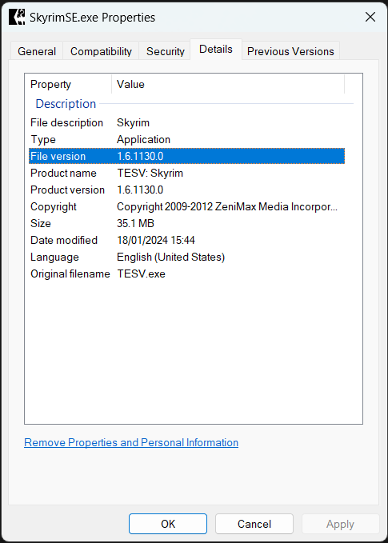 
</div> 
</div> 

Please follow the installation instructions on each of the linked pages:

| Mod | Notes |
|----------|----------|
| [SKSE](http://skse.silverlock.org/) | Once installed by following the included readme.txt, run SKSE instead of the Skyrim exe. Note that there is a separate VR version of SKSE. |
| [VR Address Library for SKSEVR](https://www.nexusmods.com/skyrimspecialedition/mods/58101) or [Address Library for SKSE Plugins](https://www.nexusmods.com/skyrimspecialedition/mods/32444) |  |
| [FonixData File (Mod Manager Install)](https://www.nexusmods.com/skyrimspecialedition/mods/40971) | For lip sync generation. |
| [UIExtensions](https://www.nexusmods.com/skyrimspecialedition/mods/17561) | If using text input instead of mic. |
| [SkyUI](https://www.nexusmods.com/skyrimspecialedition/mods/12604) | To access Mantella's MCM. |
| [Microsoft Visual C++ Redistributable 2015-2022](https://aka.ms/vs/17/release/vc_redist.x64.exe) | |
| [Mantella](https://www.nexusmods.com/skyrimspecialedition/mods/98631) |  |


### Optional Skyrim Mods
These mods aren't strictly necessary for Mantella to work, but they do greatly improve the experience.

| Mod | Notes |
|----------|----------|
| [No NPC Greetings](https://www.nexusmods.com/skyrim/mods/746) | Recommended so that Mantella voicelines are not interrupted by vanilla voicelines. |
| [World Encounter Hostility Fix - Performance Version](https://www.nexusmods.com/skyrimspecialedition/mods/91403) | Stops certain NPCs from turning hostile when you cast the Mantella spell on them. This mod requires the [Unofficial Skyrim Special Edition Patch (USSEP)](https://www.nexusmods.com/skyrimspecialedition/mods/266). Mantella needs to be loaded after USSEP in your load order. |

### Compatibility
- Some users have reported that Skyrim crashes when Mantella is used with **Fuz Ro D'oh**. A possible fix is to disable and re-enable Fuz Ro D'oh.
- Mantella requires **Windows 10 / 11** (it is yet unconfirmed whether it works on Windows 7).
- Mantella needs to be loaded after the Unofficial Skyrim Special Edition Patch (**USSEP**) mod in your load order.

____________________________________

## Usage
### Mantella UI
The Mantella UI should open in your browser when the Mantella window starts, but if it does not, it can be accessed here: [http://localhost:4999/ui/?__theme=dark](http://localhost:4999/ui/?__theme=dark).

```{admonition} Note
:class: seealso

In order to access the Mantella UI, the Mantella window needs to be running.
```

### MCM
The Mantella MCM can be accessed in-game (`SYSTEM -> MOD CONFIGURATION -> Mantella`). Many options can be tweaked here, such as NPC actions and radiant conversations.  
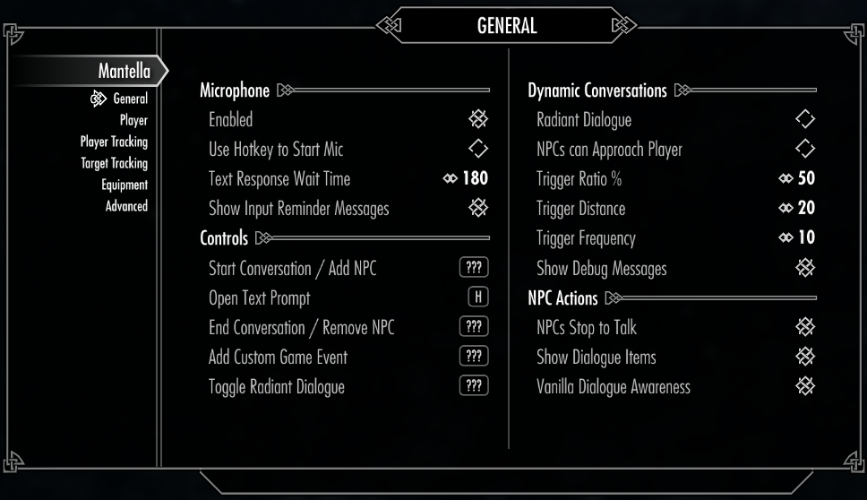  

### Conversations
The Mantella spell & power should be added to your inventory under the Illusion category in the Magic menu once you install the mod. Conversations can be started by selecting an NPC with the spell, power, hotkey (enabled in the MCM menu), or via the in-game dialogue menu. 

You can end a conversation by casting the Mantella End Conversation spell, or by simply saying / typing "goodbye" (recommended). NPCs will respond with "Safe travels" when conversations are ended via the latter method.

Once a conversation has started, you can add more NPCs to the conversation between each of your responses to start a group conversation:  
`Cast Mantella on NPC1 -> Say hi to NPC1 -> Cast Mantella on NPC2 -> Say hi to NPC1 & NPC2 etc`

Radiant conversations can also be enabled in the MCM menu. These are conversations that are randomly started between idle NPCs. You can join the conversation by casting Mantella on either NPC.

### Text Input
Text input can be enabled by disabling mic input in Mantella's MCM menu.

### Restarting the Mantella window
If for whatever reason the Mantella window crashes or gets stuck, you can restart it by going to your `Mantella MCM -> Advanced -> Restart Mantella.exe`.

### Actions
By default, actions are disabled in the Mantella MCM. You can enabled these in the MCM's `General` tab. If you struggling to get an NPC to perform an action on their own, you can force these actions to occur by simply saying / typing the action you want to occur (eg "follow", "inventory", etc).

### Saved Data
When a conversation ends, a summary of the conversation is saved to a local text file for each NPC in the conversation. These summaries are then loaded the next time an NPC is spoken with. You can view / edit these summaries in your `My Games/Mantella/data/Skyrim/conversations/YourPlayerName1/` folder.
____________________________________

## Services
While the [quick start guide](#quick-start) is the fastest way to get set up, Mantella can be heavily tweaked to your liking and can connect to a variety of different services.

### Language Models (LLMs)
LLMs power the creation of responses by NPCs. There are a number of different LLMs to choose from, ranging from free local models to large externally hosted models.

```{admonition} Note
:class: seealso

Some smaller models may struggle to handle long term conversations and memory summarising.
```

If you have already followed the [quick start guide](#quick-start) you will have an OpenRouter account set up with Gemma 2 9B, a free and easy to use LLM. You can select from a variety of other LLMs hosted on OpenRouter (both free and paid) via the `Model` option in the `Large Language Model` tab of the [Mantella UI](#mantella-ui). 

If you would prefer to use a different service, or host your own LLM locally, see the options below:

#### API Models
<details>
<summary><b>OpenAI</b></summary>  

Copy your OpenAI secret API key (see [here](https://help.openai.com/en/articles/4936850-where-do-i-find-my-secret-api-key) if you need help finding it (you will need to set up an account if you haven't already)) and paste into your `GPT_SECRET_KEY.txt` file (see the [quick start guide](#quick-start) to learn where `GPT_SECRET_KEY.txt` is stored). Note that you will need to set up your payment details for the API to work. 

Once completed, in the `LLM Service` dropdown of the `Large Language Model` tab of the [Mantella UI](#mantella-ui) select "OpenAI". Update the list of model options in the `Model` setting and select an OpenAI model.
</details>
<br>

#### Local Models
<details>
<summary><b>koboldcpp</b></summary>  

1. Install koboldcpp's latest release from [here](https://github.com/LostRuins/koboldcpp/releases). If you want to run koboldcpp on your CPU or otherwise do not have an NVIDIA GPU, download `koboldcpp_nocuda.exe` under "Assets". If you have an NVIDIA GPU with CUDA support, download `koboldcpp.exe` under "Assets".   
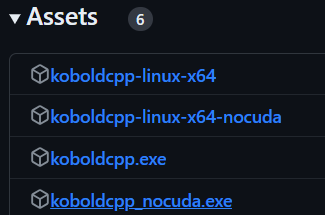  

2. Download a local model, such as `toppy-m-7b.Q4_K_S.gguf` from [here](https://huggingface.co/TheBloke/Toppy-M-7B-GGUF/tree/main?not-for-all-audiences=true).  
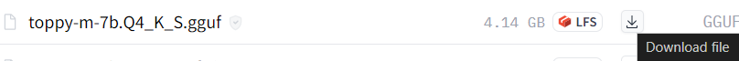  

3. Run koboldcpp.exe. When presented with the launch window, drag the "Context Size" slider to 4096. Click the "Browse" button next to the "Model" field and select the model you downloaded. Click "Launch" in the bottom right corner.  
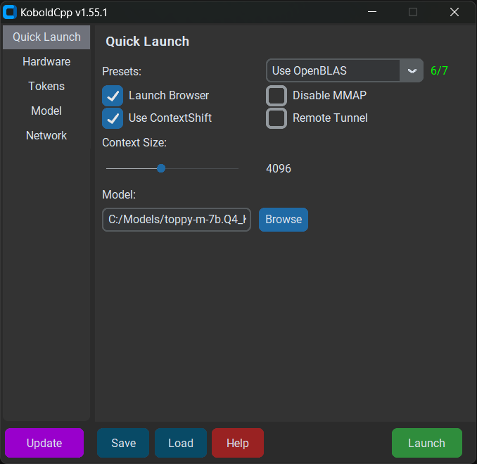  

```{admonition} Optional
:class: hint

Under the "Presets" drop down at the top, choose either Use CLBlast, or Use CuBlas (if using Cuda). You will then see a field for GPU Layers. If you want to use CPU only leave it at 0. If you want to use your GPU, you can experiment with how many "layers" to offload to your GPU based on your system.
```

4. In the `LLM Service` dropdown of the `Large Language Model` tab of the [Mantella UI](#mantella-ui) select "KoboldCpp".

```{admonition} Note
:class: seealso

Make sure koboldcpp is running when Mantella is running! 
```
</details>
<br>
<details>
<summary><b>text-generation-webui</b></summary>  

1. Install the latest text-generation-webui .zip from [here](https://github.com/oobabooga/text-generation-webui/releases).  
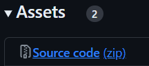  

2. Place a local model into the `text-generation-webui\models` folder (to get started, you can download `toppy-m-7b.Q4_K_S.gguf` from [here](https://huggingface.co/TheBloke/Toppy-M-7B-GGUF/tree/main?not-for-all-audiences=true)).  
  

3. Paste the text "--extensions openai --auto-launch" (as well as "--cpu" for CPU users) into the installed folder's CMD_FLAGS.txt file.  
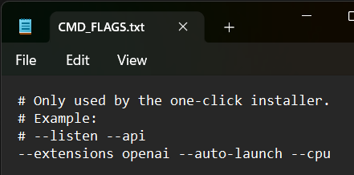  

4. Start text-generation-webui and wait for the UI to open in your web browser. Navigate to the "Model" tab, select your model from the drop-down list, and click "Load".  
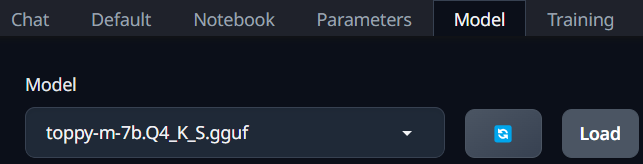  

5. In the `LLM Service` dropdown of the `Large Language Model` tab of the [Mantella UI](#mantella-ui) select "textgenwebui".

```{admonition} Note
:class: seealso

Make sure text-generation-webui is running when Mantella is running! 
```
</details>
<br>
<details>
<summary><b>LM Studio</b></summary>  

1. Download and install LM Studio from [here](https://lmstudio.ai/).  

2. Open LM Studio and download an LLM model.  

3. Go to the Developer tab, and in the drop-down at the top of the page select your model. If a Windows Firewall message pops up click Allow. Click the Start Server button.  
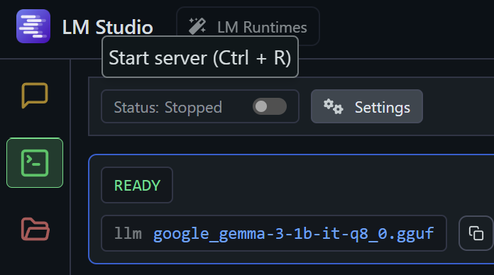  

4. In the `LLM Service` text box of the `Large Language Model` tab of the [Mantella UI](#mantella-ui), set the value to `http://localhost:1234/v1/` (ignoring the options in the drop down list). This is the URL that LM Studio is running your model on. The `Model` setting can be ignored as this has already been selected in step 2. If everything works correctly, you should see a message display in Mantella.exe saying "Running Mantella with local language model" when you start it.  
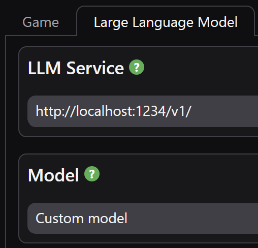  

```{admonition} Note
:class: seealso

Make sure LM Studio is running when Mantella is running! 
```
</details>
<br>
<details>
<summary><b>Ollama</b></summary>  

1. Download and install Ollama from [here](https://ollama.com/). Ollama should start running in your taskbar icons tray. If it doesn't, search for the installed application and open it.  

2. Search for a model you would like to use from [Ollama's library](https://ollama.com/library). For example, [Gemma 3 4B](https://ollama.com/library/gemma3:4b). Take note of the model ID displayed on the page (eg `gemma3:4b`).  
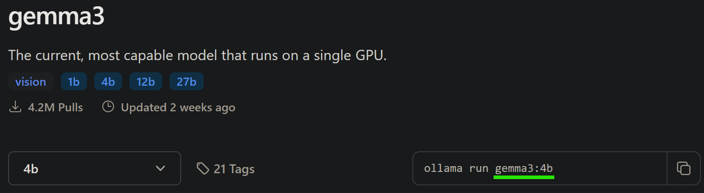  

3. Open Command Prompt (Windows key + search "cmd") and run `ollama pull <model ID>` to download the selected model (eg `ollama pull gemma3:4b`).  

4. In the `LLM Service` text box of the `Large Language Model` tab of the Mantella UI, set the value to `http://localhost:11434/v1/` (ignoring the options in the drop down list). This is the URL that Ollama is running on. Set `Large Language Model`->`Model` to the model ID from step 2 (eg `gemma3:4b`). If everything works correctly, you should see a message display in Mantella.exe saying “Running Mantella with local language model” when you start it.  
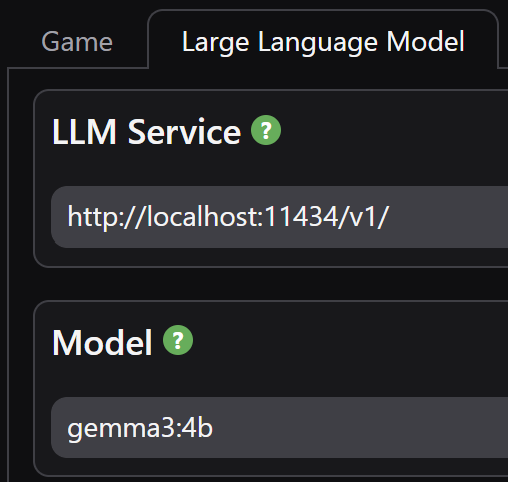  

```{admonition} Note
:class: seealso

Make sure Ollama is running when Mantella is running! 
```
</details>
<br>

#### Other LLM Services
Mantella has the ability to support other language model services, although these services do need to support outputs in the OpenAI format (like text-generation-webui does via the "--extensions openai" option above). You can connect to any OpenAI-API-compatible service by following these steps:

1. Paste the OpenAI-API-compatible URL of the service into the `LLM Service` textbox of the `Large Language Model` tab in the [Mantella UI](#mantella-ui). These URLs typically end with `/v1`.

2. (Only needed for non-local services) Paste the name of a given model of the service into the `Model` textbox of the `Large Language Model` tab.

3. (Only needed for non-local services) Paste a secret key to connect to the service in your `GPT_SECRET_KEY.txt` file (see the [quick start guide](#quick-start) to learn where `GPT_SECRET_KEY.txt` is stored).  

**Other Known Services**:
| Service | URL | Models List |
|:----------|:----------|:----------|
| Alibaba | https://dashscope-intl.aliyuncs.com/compatible-mode/v1 | [https://www.alibabacloud.com/help/en/model-studio/getting-started/models](https://www.alibabacloud.com/help/en/model-studio/getting-started/models) |
| Cerebras | https://api.cerebras.ai/v1 | [https://inference-docs.cerebras.ai/introduction](https://inference-docs.cerebras.ai/introduction) |
| Google | https://generativelanguage.googleapis.com/v1beta/openai/ | [https://ai.google.dev/gemini-api/docs/models/gemini](https://ai.google.dev/gemini-api/docs/models/gemini) |
| Groq | https://api.groq.com/openai/v1 | [https://console.groq.com/docs/models](https://console.groq.com/docs/models) |

____________________________________

### Vision
LLM vision can be enabled in the `Vision` tab of the [Mantella UI](#mantella-ui). If the selected model in the `Large Language Model` tab has vision capabilities (or if a separate vision model has been selected in the `Vision` tab), a screenshot of your game window will be passed to the model every time you respond to an NPC. Please see the documentation of your selected LLM provider to find out which models support vision. For OpenRouter models, the full list can be found [here](https://openrouter.ai/models?fmt=cards&input_modalities=image).

Vision capabilities can also be run locally via koboldcpp. To get started, download the required [mmproj file](https://huggingface.co/koboldcpp/mmproj/tree/main) for your local LLM (as an example, [Toppy](https://huggingface.co/TheBloke/Toppy-M-7B-GGUF/tree/main?not-for-all-audiences=true) requires `mistral-7b-mmproj-v1.5-Q4_1.gguf`). In the koboldcpp launch window, under the `Model Files` tab, set the path to your mmproj file via the `LLaVa mmproj` setting. When koboldcpp is launched, and vision is enabled in the [Mantella UI](#mantella-ui), your local LLM will support vision.

____________________________________

### Text-to-Speech
By default, Mantella comes packaged with a fast and local TTS service called Piper (note: Piper only supports English). Mantella can also be run with xVASynth (local) or XTTS (local / online) to generate NPC voicelines. See the comparison below  for more details:

| Feature | Piper | xVASynth | XTTS |
|:----------|:----------:|:----------:|:----------:|
| Fastest | ✔* |  |  |
| Easiest setup | ✔ |  |  |
| Highest quality |  |  | ✔ |
| Greatest emotional range |  | ✔ |  |
| Support for modded NPCs |  | ✔ | ✔ |
| Easy to create custom voice models |  |  | ✔ |
| Local support | ✔ | ✔ | ✔ |
| API support |  |  | ✔ |
| Can run on a second PC |  |  | ✔ |

*XTTS may generate faster responses when running externally.

<details>
	<summary><b>xVASynth</b></summary>  

1. Download xVASynth via [Steam](https://store.steampowered.com/app/1765720/xVASynth/) (preferred) or [Nexus](https://www.nexusmods.com/skyrimspecialedition/mods/44184). Do not store xVASynth in your Skyrim folder.

2. Download the Skyrim voice models. You can either download all models via a torrent, via the xVASynth UI if you have Nexus Premium, or manually via the Nexus Mods page:  

	<br>
	<details>
	<summary><b>xVASynth Model Installation Options</b></summary>  

   	#### 💎 Nexus Premium (Quickest)  
   	If you are subscribed to Nexus Premium, (1.) open the xVASynth UI and select "Get More Voices" from the bottom left corner. (2.) Unselect all games except for Skyrim, (3.) click "Check now" (you will be prompted to login to Nexus), then (4.) "Download All".
	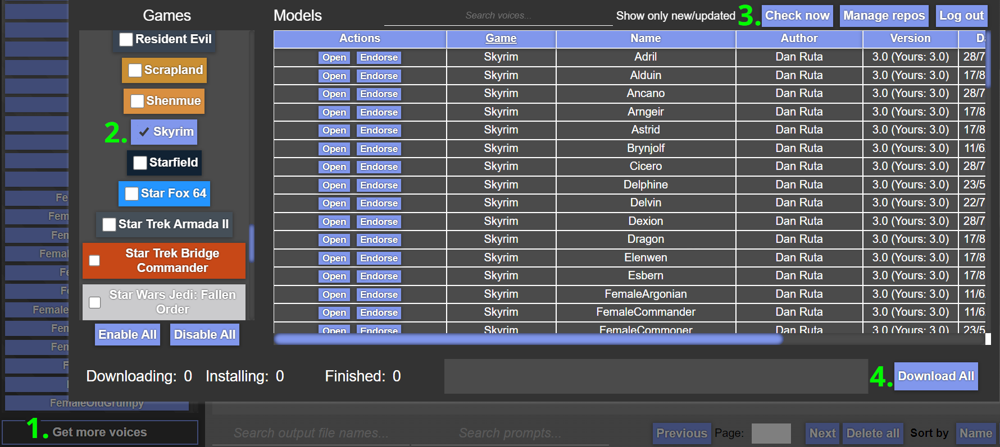  

	```{admonition} Note
	:class: seealso

	You may need to restart the download a few times for all voice models to properly download.  
	```
    
  	```{admonition} Warning
	:class: attention

	If the first voice model never finishes installing. See if the game folder exists within `resources/app/models`. If it is not there, create it and retry. As this is a known bug of xVASynth: [https://github.com/DanRuta/xVA-Synth/issues/59](https://github.com/DanRuta/xVA-Synth/issues/59)
	```

   	#### 🌊 Torrent (Slowest, Easiest)  
   	Voice models can be downloaded via a single torrent. Torrents can be downloaded via Bittorent clients such as [qBittorent](https://www.qbittorrent.org/download). Note that download speeds vary depending on the time of day. Paste the below magnet link in your browser to receive a popup to open it via your Bittorent client, and set the download location to your_xVASynth_folder/resources/app/models/skyrim:  

   	`magnet:?xt=urn:btih:798BB3190E776BFDCF590910C0805656420F45BC&dn=skyrim&tr=udp%3a%2f%2ftracker.opentrackr.org%3a1337&tr=udp%3a%2f%2fexplodie.org%3a6969&tr=wss%3a%2f%2ftracker.btorrent.xyz&tr=wss%3a%2f%2ftracker.openwebtorrent.com`  

	```{admonition} Note
	:class: seealso

	This magnet URI may be removed from this page if any voice model becomes unavailable on Nexus Mods.  
	```
   
	#### 🛠️ Manual (Hardest)  
   	If you do not have Nexus Premium, or if the torrent is not available, you can also download the voice models directly from Nexus [here](https://www.nexusmods.com/skyrimspecialedition/mods/44184?tab=files) (under "Optional", not "Old"). Once you have manually downloaded each voice model into a folder, unzip the models manually into the correct xVASynth folder (`xVASynth\resources\app\models\skyrim`). Once the extraction is complete, you can delete the zipped voice model files.  
	The contents of `xVASynth\resources\app\models\skyrim` should look like the below:  
	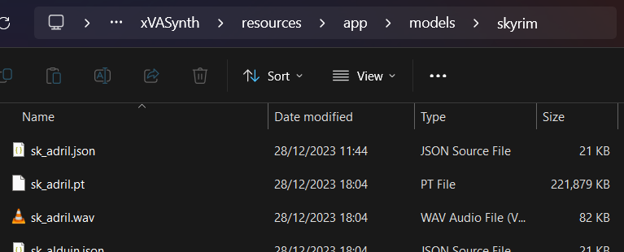

	```{admonition} Note
	:class: seealso

	If downloading all models sounds a bit daunting, you can start with the "Male Nord" and "Male Soldier" voice models to at least allow talking to Skyrim guards.
	```
	  
	</details>
	<br>

3. (Optional) Download the xVASynth DeepMoji Plugin [here](https://www.nexusmods.com/skyrimspecialedition/mods/107142). It boosts the emotionality of xVASynth voice models to make them sound less robotic (only available in English).

4. Select xVASynth in the Text-to-Speech tab of the [Mantella UI](#mantella-ui) and set the path to your xVASynth folder.
</details>
<br>

<details>
	<summary><b>XTTS</b></summary>  
	<details>
		<summary><b>Local</b></summary> 

1. Download MrHaurrus's XTTS API server from [here](https://www.nexusmods.com/skyrimspecialedition/mods/113445?tab=files) and unzip it.

2. Download the [voice models (latents) folder](https://www.nexusmods.com/skyrimspecialedition/mods/113445?tab=files) for your desired language. Extract this folder into the same folder as `xtts-api-server-mantella.exe` above. In other words, you should have a folder called `latent_speaker_folder` in your XTTS folder.

3. Select XTTS in the `Text-to-Speech` tab of the [Mantella UI](#mantella-ui) and set the path to your XTTS folder.

4. Install required lip sync files as instructed in `Text-to-Speech`->`LipGenerator Folder` setting in the Mantella UI and set the path to these files. 

5. (Optional) If you are using an NVIDIA GPU, the `XTTS DeepSpeed` setting can improve response times by 2-4x if you also have `XTTS Device` set to "cuda".

</details>  
<br>  
	<details>
	<summary><b>External (from $0.14/hr)</b></summary>  

1. Make a RunPod account ([https://www.runpod.io/](https://www.runpod.io/)) and add some credits ($10 minimum).

2. Follow [this link](https://runpod.io/console/gpu-cloud?template=x9ddee271u&ref=szjabwfp) to open the Mantella XTTS Pod. Choose a GPU to run the Pod with (if in doubt, choose the cheapest). Note that cheaper GPUs are available if you change the "Secure Cloud" setting to "Community Cloud".  
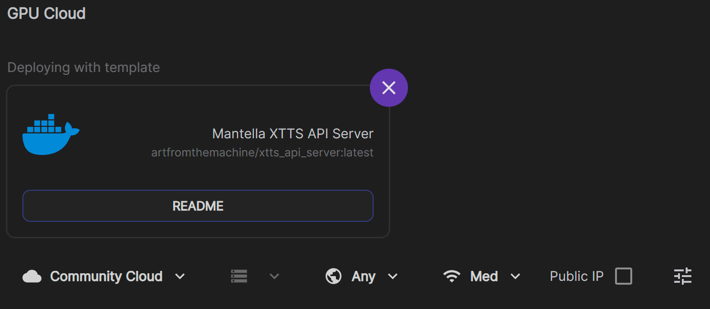

3. On the following two pages just click "Continue" and "Deploy" (you don't need to change any settings here).

4. Once the Pod is running, select XTTS in the Text-to-Speech tab of the [Mantella UI](#mantella-ui) and set `XTTS URL` to `https://{pod_id}-8020.proxy.runpod.net/`, with {pod-id} being the ID of the running Pod. Eg `https://a1b2c3d4qwerty-8020.proxy.runpod.net/`.  
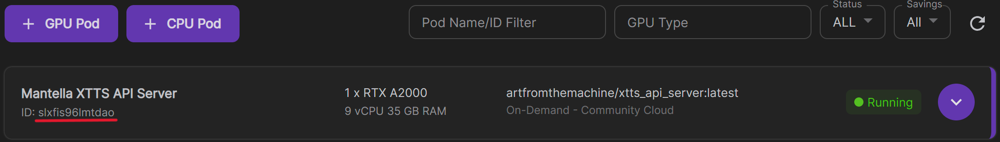

5. It takes a few minutes for the Pod to start up, you can check the progress in Logs -> Container Logs from the Pod's dropdown menu. It will say "Uvicorn running" when it is ready.

6. When you are finished using Mantella, make sure to delete the Pod so that you are no longer charged! It only takes a few clicks to set up a new Pod so don't feel guilty about deleting it.
</details>  
</details>  

____________________________________

### Whisper
<details>
<summary><b>Whisper via your CPU is handled automatically. Open this section only if you like tinkering</b></summary>  

guillaumekln's Faster-Whisper version of Whisper is used as Speech-To-Text engine by Mantella. The engine is **already part of the executable** and will download a chosen model automatically when launched. Uses a single CPU core by default when listening to the set default Windows microphone. Alternatively text input can be enabled by setting `microphone_enabled = 0` within MantellaSoftware/config.ini.

It is reasonably fast even in CPU mode with the base model. Optionally, to use GPU/CUDA mode, some extra files are required, see [Faster Whisper documentation](https://github.com/guillaumekln/faster-whisper#gpu). Note that cuBLAS may already be part of the CUDA Toolkit, so you may only require the `cudnn_###_infer64_8.dll` files to be beside the Mantella executable. Afterwards enable `process_device = cuda` under `[Microphone]` in MantellaSoftware/config.ini.
</details>
