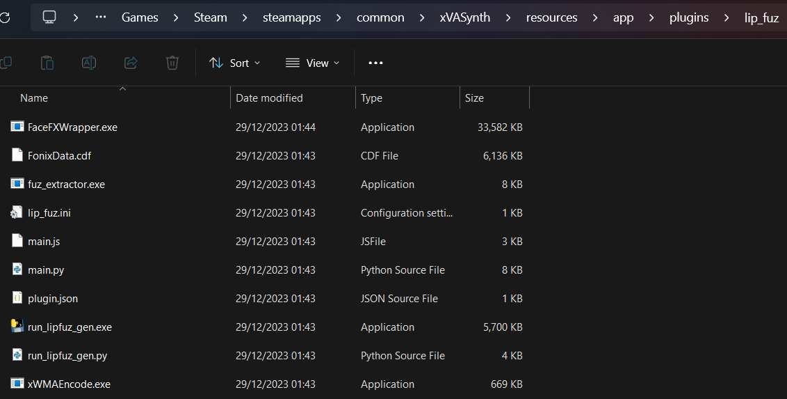

# Skyrim Installation
If you get stuck anywhere in the installation process, please see {doc}`/pages/issues_qna` or reach out on [Discord](https://discord.gg/Q4BJAdtGUE).

## Video Tutorial
For visual guides to help install Mantella, see either of these tutorial videos below:

### Dead Pixel Gaming
<iframe width="560" height="315" src="https://www.youtube.com/embed/g5q2Pm8jaOQ?si=6MoeSJ-78X5GMENi" title="YouTube video player" frameborder="0" allow="accelerometer; autoplay; clipboard-write; encrypted-media; gyroscope; picture-in-picture; web-share" allowfullscreen></iframe>

```{admonition} Note
:class: seealso

xVASynth models do not have to be downloaded manually, see [here](#text-to-speech) for more details.
```

### MrHaurrus (French with English subtitles)
<iframe width="560" height="315" src="https://www.youtube.com/embed/-zRj2zFvGo0?si=yvhmMaZFCpgMYyhg" title="YouTube video player" frameborder="0" allow="accelerometer; autoplay; clipboard-write; encrypted-media; gyroscope; picture-in-picture; web-share" allowfullscreen></iframe>

```{admonition} Note
:class: seealso

xVASynth does not need to be run before Mantella.exe, and the bugs mentioned in the video have since been fixed.
```

## Requirements
### Hardware Requirements
#### xVASynth
**CPU**  
xVASynth runs in CPU mode by default, using a single CPU core/thread. Generally, if you can already run Skyrim, xVASynth should work with most CPU setups. 

<details>
<summary><b>GPU (Optional)</b></summary>  

NVIDIA cards that have CUDA can run xVASynth in GPU mode. Using the same GPU for both xVASynth and Skyrim may cause stutter.
</details>

### Storage Requirements
This mod requires ~29GB of space when xVASynth and all voice models are installed. Temporarily another ~17GB is needed to unpack the voice models, unless the torrent is used which does not have the voice files archived.


### Compatibility
- Some users have reported that Skyrim crashes when Mantella is used with **Fuz Ro D'oh**. A possible fix is to disable and re-enable Fuz Ro D'oh
- Mantella requires **Windows 10 / 11** (it is yet unconfirmed whether it works on Windows 7)
- Mantella has been confirmed to work with the **FUS** (by pointing `skyrim_folder` to Skyrim), **Librum** (by pointing `skyrim_folder` to overwrite/root), and **Wildlands** (by pointing `skyrim_folder` to Wildlander/SKSE), and **Nolvus** Wabbajack modlists
- Mantella needs to be loaded after the Unofficial Skyrim Special Edition Patch (**USSEP**) mod in your load order

### Skyrim
```{admonition} Warning
:class: attention

As Mantella accesses and writes to files within your Skyrim folder, it is unlikely to work correctly **if you have Skyrim stored in Program Files / (x86)**. Please ensure that you have Skyrim stored outside of this folder (eg `C:\Games\Steam`).
```

Steam does not allow to create a new Steam Game Library on the same disk. You can either move the whole Steam client outside [as described on this Steam Support page](https://help.steampowered.com/en/faqs/view/4BD4-4528-6B2E-8327) or use [LostDragonist/steam-library-setup-tool](https://github.com/LostDragonist/steam-library-setup-tool/wiki/Usage-Guide) to allow multiple Steam Game Libraries on one disk.

### Mantella Files
The Mantella files can be downloaded from [Nexus Mods](https://www.nexusmods.com/skyrimspecialedition/mods/98631).

| File | Installation |
|----------|----------|
| Mantella Software | Extract this folder somewhere convenient to you (if you need some inspiration, you can store it in Documents). **Do not store this folder in Program Files / (x86), Desktop, or your Skyrim folder**. |
| Mantella Spell | This file can be installed in the same way as other mods with your mod manager. |

## Text-to-Speech
Mantella can either be run with xVASynth or XTTS to generate the voicelines for NPCs. It is recommended to start with xVASynth because it is has lower hardware requirements than XTTS, but if you either have a powerful GPU / don't mind paying to run XTTS externally you can choose this option below.

<details>
	<summary><b>xVASynth</b></summary>  

1. Download xVASynth via [Steam](https://store.steampowered.com/app/1765720/xVASynth/) (preferred) or [Nexus](https://www.nexusmods.com/skyrimspecialedition/mods/44184). Do not store xVASynth in your Skyrim folder.

2. Download the Skyrim voice models. You can either download all models via a torrent, via the xVASynth UI if you have Nexus Premium, or manually via the Nexus Mods page:  

	<br>
	<details>
	<summary><b>xVASynth Model Installation Options</b></summary>  

   	#### 💎 Nexus Premium (Quickest)  
   	If you are subscribed to Nexus Premium, (1.) open the xVASynth UI and select "Get More Voices" from the bottom left corner. (2.) Unselect all games except for Skyrim, (3.) click "Check now" (you will be prompted to login to Nexus), then (4.) "Download All".
	  

	```{admonition} Note
	:class: seealso

	You may need to restart the download a few times for all voice models to properly download.  
	```

   	#### 🌊 Torrent (Slowest, Easiest)  
   	Voice models can be downloaded via a single torrent. Torrents can be downloaded via Bittorent clients such as [qBittorent](https://www.qbittorrent.org/download). Note that download speeds vary depending on the time of day. Paste the below magnet link in your browser to receive a popup to open it via your Bittorent client, and set the download location to your_xVASynth_folder/resources/app/models/skyrim:  

   	`magnet:?xt=urn:btih:798BB3190E776BFDCF590910C0805656420F45BC&dn=skyrim&tr=udp%3a%2f%2ftracker.opentrackr.org%3a1337&tr=udp%3a%2f%2fexplodie.org%3a6969&tr=wss%3a%2f%2ftracker.btorrent.xyz&tr=wss%3a%2f%2ftracker.openwebtorrent.com`  

	```{admonition} Note
	:class: seealso

	This magnet URI may be removed from this page if any voice model becomes unavailable on Nexus Mods.  
	```
   
	#### 🛠️ Manual (Hardest)  
   	If you do not have Nexus Premium, or if the torrent is not available, you can also download the voice models directly from Nexus [here](https://www.nexusmods.com/skyrimspecialedition/mods/44184?tab=files) (under "Optional", not "Old"). Once you have manually downloaded each voice model into a folder, unzip the models manually into the correct xVASynth folder (`xVASynth\resources\app\models\skyrim`). Once the extraction is complete, you can delete the zipped voice model files.  
	The contents of `xVASynth\resources\app\models\skyrim` should look like the below:  
	

	```{admonition} Note
	:class: seealso

	If downloading all models sounds a bit daunting, you can start with the "Male Nord" and "Male Soldier" voice models to at least allow talking to Skyrim guards.
	```
	  
	</details>
	<br>


4. Download the .lip plugin for xVASynth [here](https://www.nexusmods.com/skyrimspecialedition/mods/55605) and download FaceFXWrapper from [here](https://www.nexusmods.com/skyrimspecialedition/mods/20061) (you do not need to download CK64Fixes). Instructions on how to install these are on the .lip plugin Nexus page. Make sure to place FaceFXWrapper in the plugins folder as stated on the .lip plugin page.  
When installed correctly, it should look like the below:  


5. (Optional) Download the xVASynth DeepMoji Plugin [here](https://www.nexusmods.com/skyrimspecialedition/mods/107142). It boosts the emotionality of xVASynth voice models to make them sound less robotic (only available in English).
</details>
<br>

<details>
	<summary><b>XTTS</b></summary>  
	See here for MrHaurrus's tutorial on setting up XTTS, or read the instructions below:  
	<iframe width="560" height="315" src="https://www.youtube.com/embed/gvT0t87JVjo?si=Pvh3tSixieccuTwj" title="YouTube video player" frameborder="0" allow="accelerometer; autoplay; clipboard-write; encrypted-media; gyroscope; picture-in-picture; web-share" referrerpolicy="strict-origin-when-cross-origin" allowfullscreen></iframe>  
	<details>
		<summary><b>Local</b></summary> 

1. Download MrHaurrus's XTTS API server from [here](https://www.nexusmods.com/skyrimspecialedition/mods/113445?tab=files) and unzip it.

2. Download the [voice models (latents) folder](https://www.nexusmods.com/skyrimspecialedition/mods/113445?tab=files) for your desired language. Extract this folder into the same folder as `xtts-api-server-mantella.exe` above. In other words, you should have a folder called `latent_speaker_folder` in your XTTS folder.

3. Download the .lip plugin [here](https://www.nexusmods.com/skyrimspecialedition/mods/55605) and download FaceFXWrapper from [here](https://www.nexusmods.com/skyrimspecialedition/mods/20061) (you do not need to download CK64Fixes). Instructions on how to install these are on the .lip plugin Nexus page. Make sure to place FaceFXWrapper in the plugins folder as stated on the .lip plugin page.  

4. Set `xtts_server_folder` in MantellaSoftware/config.ini to the path of your new exe, and `tts_service` to "XTTS".

5. (Optional) Configure XTTS settings in the [Speech.Advanced] section of MantellaSoftware/config.ini. Note that if you are using an NVIDIA GPU, the `xtts_deepspeed` setting can improve response times by 2-4x if you also have `xtts_device` set to "cuda".

</details>  
<br>  
	<details>
	<summary><b>External (from $0.14/hr)</b></summary>  

1. Make a RunPod account ([https://www.runpod.io/](https://www.runpod.io/)) and add some credits ($10 minimum).

2. Follow [this link](https://runpod.io/console/gpu-cloud?template=x9ddee271u&ref=szjabwfp) to open the Mantella XTTS Pod. Choose a GPU to run the Pod with (if in doubt, choose the cheapest). Note that cheaper GPUs are available if you change the "Secure Cloud" setting to "Community Cloud".  


3. On the following two pages just click "Continue" and "Deploy" (you don't need to change any settings here).

4. Once the Pod is running, in your MantellaSoftware/config.ini set `tts_service` to "XTTS" and `xtts_url` to `https://{pod_id}-8020.proxy.runpod.net/`, with {pod-id} being the ID of the running Pod. Eg `https://a1b2c3d4qwerty-8020.proxy.runpod.net/`.  


5. It takes a few minutes for the Pod to start up, you can check the progress in Logs -> Container Logs from the Pod's dropdown menu. It will say "Uvicorn running" when it is ready.

6. When you are finished using Mantella, make sure to delete the Pod so that you are no longer charged! It only takes a few clicks to set up a new Pod so don't feel guilty about deleting it.
</details>  
</details>  

## Required Skyrim Mods
```{admonition} Warning
:class: attention

Always ensure you are downloading the right version of each mod for your version of Skyrim. **This is the #1 reason for installation problems.** You can check your Skyrim version by right-clicking its exe file in your Skyrim folder and going to Properties -> Details -> File version. VR users can just download the VR version of each mod if available, or SE if not.
```


Please follow the installation instructions on each of the linked pages:

| Mod | Notes |
|----------|----------|
| [SKSE](http://skse.silverlock.org/) | Once installed by following the included readme.txt, run SKSE instead of the Skyrim exe. Note that there is a separate VR version of SKSE |
| [VR Address Library for SKSEVR](https://www.nexusmods.com/skyrimspecialedition/mods/58101) or [Address Library for SKSE Plugins](https://www.nexusmods.com/skyrimspecialedition/mods/32444) |  |
| [PapyrusUtil SE]( https://www.nexusmods.com/skyrimspecialedition/mods/13048) | **The VR version can be found under "Miscellaneous Files"** |
| [UIExtensions](https://www.nexusmods.com/skyrimspecialedition/mods/17561) | If using text input instead of mic |
| [SkyUI](https://www.nexusmods.com/skyrimspecialedition/mods/12604) | To access Mantella's MCM |


## Optional Skyrim Mods
These mods aren't strictly necessary for Mantella to work, but they do greatly improve the experience.

| Mod | Notes |
|----------|----------|
| [No NPC Greetings](https://www.nexusmods.com/skyrim/mods/746) | Recommended so that Mantella voicelines are not interrupted by vanilla voicelines. |
| [World Encounter Hostility Fix - Performance Version](https://www.nexusmods.com/skyrimspecialedition/mods/91403) | Stops certain NPCs from turning hostile when you cast the Mantella spell on them. This mod requires the [Unofficial Skyrim Special Edition Patch (USSEP)](https://www.nexusmods.com/skyrimspecialedition/mods/266). Mantella needs to be loaded after USSEP in your load order. |

## Language Models (LLMs)
LLMs power the creation of responses by NPCs. There are a number of different LLMs to choose from, ranging from free local models to large externally hosted models.

```{admonition} Note
:class: seealso

Some smaller models may struggle to handle long term conversations and memory summarising.
```

By default Mantella is set up to run with Toppy, a free and easy to use model hosted on OpenRouter. It is recommended to start with this model. To learn how to get started, see the OpenRouter section below.

### API Models
<details>
<summary><b>OpenRouter (Free Models Available)</b></summary>  

Create an account with OpenRouter. Go to the "Keys" tab and generate a new key, saving its value to `MantellaSoftware/GPT_SECRET_KEY.txt` (do not share this secret key with anyone). This is all you need to do to get started with Toppy, Mantella's default model.

While Toppy is a good model to get started with, it can fall short when trying to handle complex conversations, in-game lore, or long term memories. To try out a different model, in MantellaSoftware/config.ini set `model` to a model from the list [here](https://openrouter.ai/docs#models) (eg `undi95/toppy-m-7b`). Note that the majority of other models are not free, and you will need to add credits to your account to use them.
</details>
<br>

<details>
<summary><b>OpenAI</b></summary>  

Copy your OpenAI secret API key (see [here](https://help.openai.com/en/articles/4936850-where-do-i-find-my-secret-api-key) if you need help finding it (you will need to set up an account if you haven't already)) and paste into `MantellaSoftware/GPT_SECRET_KEY.txt`. Do not share this key with anyone. Note that you will need to set up your payment details for the API to work.
</details>
<br>

### Local Models
<details>
<summary><b>koboldcpp</b></summary>  

1. Install koboldcpp's latest release from [here](https://github.com/LostRuins/koboldcpp/releases). If you want to run koboldcpp on your CPU or otherwise do not have an NVIDIA GPU, download `koboldcpp_nocuda.exe` under "Assets". If you have an NVIDIA GPU with CUDA support, download `koboldcpp.exe` under "Assets".   
  

2. Download a local model, such as `toppy-m-7b.Q4_K_S.gguf` from [here](https://huggingface.co/TheBloke/Toppy-M-7B-GGUF/tree/main?not-for-all-audiences=true).  
  

3. Run koboldcpp.exe. When presented with the launch window, drag the "Context Size" slider to 4096. Click the "Browse" button next to the "Model" field and select the model you downloaded. Click "Launch" in the bottom right corner.  
  

```{admonition} Optional
:class: hint

Under the "Presets" drop down at the top, choose either Use CLBlast, or Use CuBlas (if using Cuda). You will then see a field for GPU Layers. If you want to use CPU only leave it at 0. If you want to use your GPU, you can experiment with how many "layers" to offload to your GPU based on your system.
```

```{admonition} Note
:class: seealso

Make sure koboldcpp is running when Mantella is running! 
```
</details>
<br>
<details>
<summary><b>text-generation-webui</b></summary>  

1. Install the latest text-generation-webui .zip from [here](https://github.com/oobabooga/text-generation-webui/releases).  
  

2. Place a local model into the `text-generation-webui\models` folder (to get started, you can download `toppy-m-7b.Q4_K_S.gguf` from [here](https://huggingface.co/TheBloke/Toppy-M-7B-GGUF/tree/main?not-for-all-audiences=true)).  
  

3. Paste the text "--extensions openai --auto-launch" (as well as "--cpu" for CPU users) into the installed folder's CMD_FLAGS.txt file.  
  

4. Start text-generation-webui and wait for the UI to open in your web browser. Navigate to the "Model" tab, select your model from the drop-down list, and click "Load".  
  

```{admonition} Note
:class: seealso

Make sure text-generation-webui is running when Mantella is running! 
```
</details>
<br>

### Other LLM Services
Mantella has the ability to support other language model services, although these services do need to support outputs in the OpenAI format (like text-generation-webui does via the "--extensions openai" option above).

## Whisper
<details>
<summary><b>Whisper via your CPU is handled automatically. Open this section only if you like tinkering</b></summary>  

guillaumekln's Faster-Whisper version of Whisper is used as Speech-To-Text engine by Mantella. The engine is **already part of the executable** and will download a chosen model automatically when launched. Uses a single CPU core by default when listening to the set default Windows microphone. Alternatively text input can be enabled by setting `microphone_enabled = 0` within MantellaSoftware/config.ini.

It is reasonably fast even in CPU mode with the base model. Optionally, to use GPU/CUDA mode, some extra files are required, see [Faster Whisper documentation](https://github.com/guillaumekln/faster-whisper#gpu). Note that cuBLAS may already be part of the CUDA Toolkit, so you may only require the `cudnn_###_infer64_8.dll` files to be beside the Mantella executable. Afterwards enable `process_device = cuda` under `[Microphone]` in MantellaSoftware/config.ini.
</details>

## Setup & Configuration
1. Set up the MantellaSoftware/config.ini file with your paths to Skyrim (`skyrim_folder`), xVASynth (`xvasynth_folder`) / XTTS (`xtts_server_folder`), and the Mantella Skyrim mod (`mod_folder`). Change `game` to "Skyrim" if you are not running Mantella in VR.

	<br>
	<details>
	<summary><b>Mod Organizer 2 Users</b></summary>  

	- **skyrim_folder**  
	By default, this is simply the path to your Skyrim folder. If you are using a Wabbajack modlist, you may need to try searching for a folder called overwrite/root or "Stock Game" in your Mod Organizer 2 / Wabbajack installation path and set this as your `skyrim_folder` path. For FUS users, once you set this path and cast the spell once, you then need to set your `skyrim_folder` path back to your actual Skyrim folder.

	- **mod_folder**  
	You can find the mod folder by right clicking the mod in the Mod Organizer 2 UI and selecting "Open in Explorer":  
	  
	</details>
	<br>
	<details>
	<summary><b>Vortex Users</b></summary>  
 
	- **skyrim_folder**  
	This is simply the path to your Skyrim folder.  

	- **mod_folder**  
	You need to point `mod_folder` to your Skyrim/Data folder. So essentially, you need to take the Skyrim folder set in `skyrim_folder` and add "\Data" to the end of it. For example:  
	`mod_folder = C:\Games\Steam\steamapps\common\Skyrim Special Edition\Data`  
	</details>
	<br>
2. Run Mantella.exe in MantellaSoftware and wait for the message "Waiting for player to select an NPC..." to display. Once it does, it is ready for you to select an NPC in-game via the Mantella spell.  
  
```{admonition} Warning
:class: attention

Do not try to run Mantella.exe through Mod Organizer 2 / Vortex as it will not work correctly.
```

3. When you first load the mod, MAKE SURE TO CREATE A SAVE AND RELOAD THAT SAVE. The voicelines will not play otherwise! You do not have to start a new game to do this, you can also create a new save in an existing game. 

```{admonition} Note
:class: seealso

While there have not been issues reported with using Mantella in an existing save so far, please be aware that adding mods mid-game can cause problems.
```

The Mantella spell & power should be added to your inventory under the Illusion category in the Magic menu once you install the mod. Conversations can be started by selecting an NPC with the spell, power, or hotkey (default is H). You can end a conversation by casting the Mantella End Conversation spell, or by simply saying / typing "goodbye". If the NPC responds with "safe travels" then the conversation has ended correctly via this latter method.  


## Other Tips
### Text Input
Text input can be enabled by either setting `microphone_enabled = 0` in MantellaSoftware/config.ini or via Mantella's MCM in-game.

### Group Conversations
Once a conversation has started, you can add more NPCs to the conversation between each of your responses:  
`Cast Mantella on NPC1 -> Say hi to NPC1 -> Cast Mantella on NPC2 -> Say hi to NPC1 & NPC2 etc`

### MCM
Many options can be tweaked in the Mantella MCM, such as NPC actions and radiant conversations.  
  

### NPCs not Found
If the NPC is unavailable to Mantella (most likely a modded NPC which you can add yourself via {doc}`/pages/adding_modded_npcs`), the message "Conversation ended." should immediately pop up in the top left corner and the conversation will exit. If the only message you see from the spell is "Conversation ended", please refer to the "Issues Q&A" section for common solutions to this.

### Caching
Voicelines are cached in the `MantellaSoftware/data/voicelines/` folder. If this data takes up too much space over time, the contents of voicelines/ can be periodically deleted.

### Issues
If you are experiencing errors, please see {doc}`/pages/issues_qna`. Otherwise, please share the details of the errors and your MantellaSoftware/logging.log file on the Mantella Discord [#issues channel](https://discord.gg/Q4BJAdtGUE).