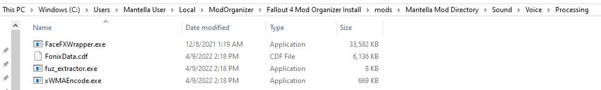
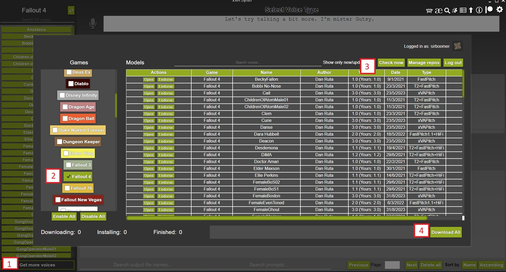
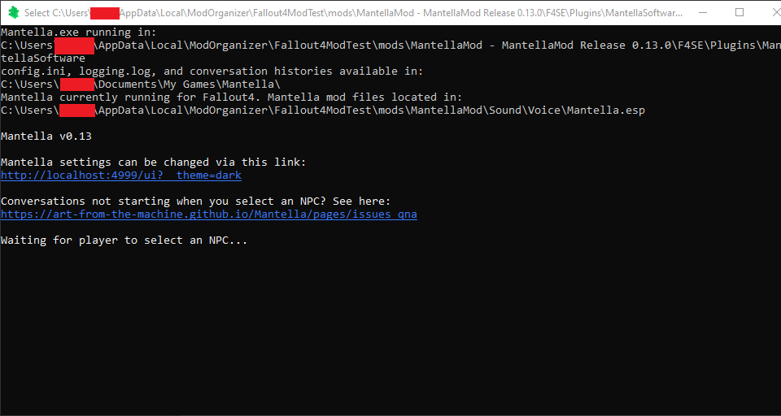
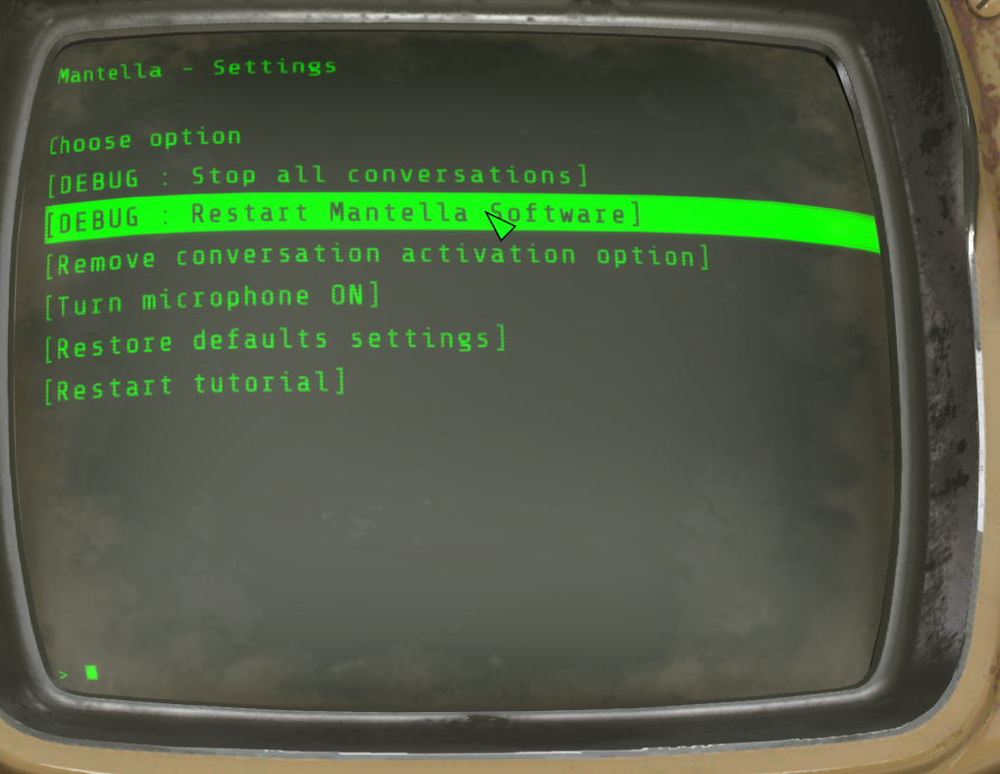
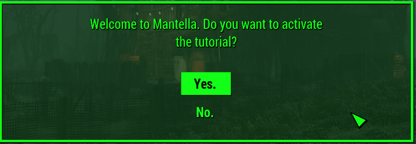
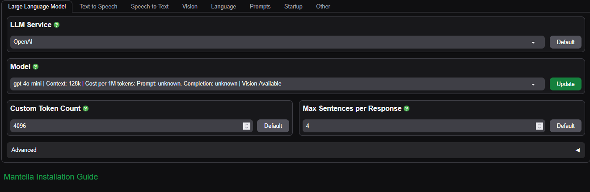

# Fallout 4 Installation
<i>NPCs redefined</i>

## General info 
<i>(click the arrows below for more details on each topic)</i>
<details> <summary><b>🔍   What is Mantella?</b></summary>

Mantella Software is a client interface for Fallout 4 and other Bethesda games. It allows Fallout 4 to send user and game output to an LLM (large language model) AI and play the response in-game using the character’s voice—even taking in-game actions!

The result? NPC interactions where characters dynamically respond to events in the game world with on-the-fly, AI-generated dialogue—no more canned lines.

In other words, Mantella lets you step outside the script when talking to characters. Dialogue is dynamically generated, with each character having their own personality and history.
</details> <br> 
<details> <summary><b>🆕 What's New?</b></summary>

A LOT has happened since Mantella 0.8.2. Here’s a quick rundown:

✅ Much Easier Install Process
The main user feedback we got—installation was too complicated. We heard you! It’s now much more straightforward and has fewer required components.

🌐 New Web Browser UI
On launch, Mantella opens a configuration tab in your default browser, letting you tweak settings on the fly.

🔌 F4SE Integration
The Mantella mod now includes F4SE files for seamless communication between Mantella and Fallout 4.

🔊 Immersive Audio/Subtitles
Mantella-generated dialogue now plays directly in-game through the engine’s subtitle and audio systems.

🔁 Fallout 4 NG Compatibility
Works with the latest FO4 patch. Mantella no longer requires SUP F4SE or DLCs.

👁️ Vision Support (Optional)
If your LLM supports image analysis, Mantella can use that to describe in-game scenes. This increases token usage and latency slightly.

🧱 Stability Boost
Refactored code = fewer dropped conversations and better reliability.

🧠 Piper TTS Support
Not to be confused with Piper the NPC. It’s a lightweight alternative to XTTS and xVASynth.

📦 Unified Mod Package
Desktop and VR ESPs are now merged into a single plugin.

🛒 New Actions via Dialogue
NPCs can now:

	Open inventories for trading

	Stay put during dialogue

	Suppress most random scripted chatter during Mantella convos

	Speak voiced player replies

	Use a narrator voice for non-verbal actions

🐞 Multiple Bugfixes

</details> <br> 
<details> <summary><b>⚙️ Features</b></summary>

🎙️ Interact with AI-powered NPCs using your voice or your keyboard

👥 Works with every NPC—even modded ones

🧾 600+ NPCs have unique personality backstories

🤖 Supports local and cloud LLMs including:

	koboldcpp

	text-generation-webui

	OpenAI

	OpenRouter

🔊 Supported Text-to-Speech Services:

	🧼 Piper TTS
	Lightweight and easy to install (~5GB), supports all voice types (including robots and mutants). Voices are monotone but resemble characters.

	🧽 XVASynth
	Medium difficulty install (~13GB), supports most voices. Voices can sound robotic, but plugins like DeepMoji Plugin  and Punctuation Pitch Adjuster  to help improve realism.
	🧠 XTTS
	Heavy on system resources (~3GB). Excellent human-quality voices. Struggles with robots/mutants and may produce unexpected accents.

🌍 Partial multilingual support

🧠 NPC memory for past conversations

🕵️ NPC awareness of world state:

	Current location

	Time

	Equipping/swapping items

	Sleeping

	Radiation/regular damage

	Power armor status

	Player commands

💬 NPCs can:

	Start conversations with each other (Radiant Dialogue)

	Talk to multiple people at once

	Become followers

	React emotionally

	Share their inventory

	Respond to visual focus if vision analysis is enabled

	Works with:

	Fallout 4 (pre/post NG)

	Fallout 4 VR

</details> <br>

<details> <summary><b>🧩 Components / Architecture Overview</b></summary>

Mantella weaves together multiple advanced technologies, offering deep customization and a dynamic gameplay experience.

Some of the key systems powering Mantella:

    🤖 Large Language Models (LLMs)

    🎙️ Speech recognition

    🔊 Speech synthesis

    👁️ Vision analysis

    🧠 Character bios & conversation history tracking

Understanding these pieces—and how they interact—helps you get the most out of Mantella and tailor it to your playstyle.
🛠️ Core Components Installed with Mantella for Fallout 4:

    Mantella.exe Application
    Automatically starts with Fallout 4. It runs alongside the game and handles:

        📡 Communication with local or remote LLMs (formats requests/responses)

        🎤 Speech-to-text processing for vocal input

        🗣️ TTS engine communication, converting AI text into character voice lines

        🧠 NPC bio and conversation history management

    MantellaLauncher (F4SE plugin)
    Automatically starts Mantella.exe when Fallout 4 launches.

    F4SE_HTTP (F4SE plugin)
    Manages real-time communication between Fallout 4 and Mantella.exe.

    TopicInfoPatcher (F4SE plugin)
    Provides utility functions, including dynamic in-game subtitle support.

    Mantella Papyrus Scripts
    Directly interact with the Fallout 4 engine and in-game systems.

    Data Files
    Includes core files such as Mantella.esp, NPC bios, and configuration settings

</details> <br>

## Fallout 4 Mantella Installation
If you get stuck anywhere in the installation process, please see {doc}`/pages/issues_qna` or reach out on [Discord](https://discord.gg/Q4BJAdtGUE).

## Requirements
### Hardware Requirements

Keep in mind these are in **addition to your FO4 RAM/VRAM requirements.**

#### <u>Minimum specifications if using external services </u>
##### **DISK SPACE**
Between 6 to 7 GB of disk space.

##### **CPU/RAM**  

- **Piper TTS or XVASynth:** If you are using external LLM services like OpenAI or Openrouter then the only requirements are running the text-to-speech and speech-to-text (if using the microphone). Piper (TTS) and Whisper (STT) can easily be run on most modern CPUs, the former uses about 0.1 GB of RAM and the latter about 1 GB.
- **XTTS:** About 3-4 GB of RAM if using XTTS and Whisper at the same time.

##### **GPU/VRAM**  
- **Piper TTS + Text input** 0.1 GB of VRAM if using text input and Piper TTS
- **Piper TTS + Whisper** Approx one GB of VRAM if using Whisper's voice recognition and Piper TTS.
- **XVASynth** Will barely use any RAM if in CPU mode.
- **XTTS + Whisper** 3–4 GB of VRAM if using XTTS and Whisper.

#### Minimum specifications if using external services

- **In addition to the specs listed above** : Minimum 6 GB of free RAM/VRAM, at least 12-15 is optimal if you want to run a good roleplay LLM locally.

### Supported game versions

- Pre-NG (1.10.163.0) – December 2019 patch
- NG (1.10.984.0) – April 2024 patch
- VR (1.2.72.0)


### <u>Required files</u>

#### Mandatory
The Mantella files can be downloaded from [Nexus Mods](https://www.nexusmods.com/fallout4/mods/79747).

| File | Installation |
|----------|----------|
| [Mantella Mod](https://www.nexusmods.com/fallout4/mods/79747?tab=files) | This file can be installed in the same way as other mods with your mod manager. Be sure to use the latest version |

#### F4SE and related installs
- Mandatory for all versions: [F4SE](https://f4se.silverlock.org/)  Make sure to get the appropriate version : pre NG (1.10.163), post NG (1.10.984), or VR(1.2.72 ). Once installed, run f4se_loader.exe instead of Fallout4.exe.  
- Mandatory for desktop: [Address library for desktop](https://www.nexusmods.com/fallout4/mods/47327) 
- Mandatory for VR: [Address library for VR ](https://www.nexusmods.com/fallout4/mods/64879)
#### Mod manager
- Recommended: [Mod Organizer 2](https://www.nexusmods.com/skyrimspecialedition/mods/6194) 
- Alternative: [Vortex](https://www.nexusmods.com/about/vortex/)
#### Other needed files
- Mandatory for desktop: [Simple Text Field](https://www.nexusmods.com/fallout4/mods/87074) 
- Mandatory for all versions to make voice generation work : [Fallout 4 Creation Kit](https://store.steampowered.com/app/1946160/Fallout_4_Creation_Kit/) 


### Troubleshooting files

```{admonition} ONLY DO THESE STEPS BELOW IF YOU'RE EXPERIENCING ISSUES WITH VOICE GENERATION. BY DEFAULT THE CREATION KIT SHOULD BE SUFFICIENT TO MAKE VOICE GENERATION WORK.
- ALTERNATIVE : Get the following files listed below [IN THIS LINK HERE](https://www.nexusmods.com/skyrimspecialedition/mods/55605) and copy them in this directory  Data\Sound\Voice\Processing (or your mod manager's equivalent path. For example for MO2 : [My Mantella Mod Name]\Sound\Voice\Processing)
- FonixData.cdf
- fuz_extractor.exe
- xWMAEncode.exe 
- Get FaceFXWrapper.exe and put it in the same directory: [link](https://github.com/Nukem9/FaceFXWrapper/releases)
```{admonition} Warning
:class: attention
	 On the first conversation run you might get prompted by Windows Explorer to install Microsoft .NET Framework 3.5. If that’s the case install it by following the windows prompts.
```	
<details>
	<summary>OPTIONAL: Alternative download links for the files</summary>

1. FonixData.cdf file: [this link](https://www.nexusmods.com/newvegas/mods/61248/) or [this link](https://www.nexusmods.com/skyrimspecialedition/mods/40971?tab=description), necessary for lip sync 
2. xWMAEncode.exe: [link](https://www.microsoft.com/en-ca/download/details.aspx?id=6812), necessary for audio play : You only need to install the utilities from the installer then go to : [installation directory]\Microsoft DirectX SDK (June 2010)\Utilities\bin\x86\  to find the executable
3. fuz_extractor.exe: [link](https://github.com/Backporter/fuz_extractor/releases), necessary for audio play
</details>

What it should look like for MO2 : 
  
What it should look like for Vortex: 
  

### Installation Procedure
```{admonition} Warning
:class: attention

For Mantella to work properly you have to **enable archive invalidation** in your Fallout 4 ini file if you haven't already done so. See [here](https://www.nexusmods.com/fallout4/articles/3831) for instructions.
```
#### Using Vortex or MO2

    Download and install F4SE (use the version compatible with your game)

    Download and install Address Library

    If not running VR, also install Simple Text Field

    Install the Mantella mod from Nexus

    Install the Fallout 4 Creation Kit

##### 🛠️ Key Configurable Components
###### Speech-to-Text(STT): Moonshine / Whisper

Enable it in the Speech-to-Text tab of the config page

Adjust the audio threshold so Mantella can detect your voice reliably

Ensure your microphone is enabled via the holotape

###### Text-to-Speech Options 


Install these separately and set the paths in the Text-to-Speech tab of Mantella’s config page.
<br><i>(click the arrows below for more details on how to install)</i>
<details> <summary><b>Piper (Preferred option)</b> </summary>

Comes bundled with Mantella

Recommended for users without CUDA-compatible GPUs or who prefer a simple setup

</details> 

</details> 
<details>
	<summary><b>xVASynth (optional)</b></summary>  

1. Download xVASynth via [Steam](https://store.steampowered.com/app/1765720/xVASynth/) (preferred) or [Nexus](https://www.nexusmods.com/skyrimspecialedition/mods/44184?tab=files). Do not store xVASynth in your Fallout 4 game folder. For better output consider adding : 	

[DeepMoji Plugin](https://www.nexusmods.com/skyrimspecialedition/mods/107142) : For adjusted voice performance according to the emotion of the sentence (happy, sad, angry, surprised).

[Punctuation Pitch Adjuster](https://bunglepaws.neocities.org/downloads/punctuation_pitch_adjuster_for_xvasynth.zip) : For more realistic pitch fluctuation when exclamation and question marks are detected.
<summary><b>GPU (Optional)</b></summary>  

NVIDIA cards that have CUDA can run xVASynth in GPU mode. Using the same GPU for both xVASynth and Fallout 4 may cause stutter.
2. Download the Fallout 4 voice models. You can either download all models via the xVASynth UI if you have Nexus Premium, or manually via the [Nexus mods page](https://www.nexusmods.com/fallout4/mods/49340):  

<br>
<summary><b>xVASynth Model Installation Options</b></summary>  

💎 Nexus Premium (Quickest)  
If you are subscribed to Nexus Premium, (1.) open the xVASynth UI and select "Get More Voices" from the bottom left corner. (2.) Unselect all games except for Fallout 4, (3.) click "Check now" (you will be prompted to login to Nexus), then (4.) "Download All".
  

```{admonition} Note
:class: seealso

You may need to restart the download a few times for all voice models to properly download.  
```

```{admonition} Warning
:class: attention

If the first voice model never finishes installing. See if the game folder exists within `resources/app/models`. If it is not there, create it and retry. As this is a known bug of xVASynth: [https://github.com/DanRuta/xVA-Synth/issues/59](https://github.com/DanRuta/xVA-Synth/issues/59)
```
🌊 Torrent (Slowest, Easiest)  
Voice models can be downloaded via a single torrent. Torrents can be downloaded via BitTorrent clients such as [qBittorent](https://www.qbittorrent.org/download). Note that download speeds vary depending on the time of day. Paste the below magnet link in your browser to receive a popup to open it via your Bittorent client, and set the download location to `your_xVASynth_folder/resources/app/models/` without creating an extra subfolder:

`magnet:?xt=urn:btih:c9cd4a5f766bee3bdb758ff37578440a9ce2dee2&dn=Fallout_4_XVASynth_Voices&tr=udp%3A%2F%2Ftracker.opentrackr.org%3A1337&tr=wss%3A%2F%2Ftracker.openwebtorrent.com&tr=udp%3A%2F%2Fexplodie.org%3A6969&tr=wss%3A%2F%2Ftracker.btorrent.xyz`  

🛠️ Manual  
If you do not have Nexus Premium, you can also download the voice models directly from Nexus [here](https://www.nexusmods.com/fallout4/mods/49340?tab=files) (under "Optional", not "Old"). Once you have manually downloaded each voice model into a folder, unzip the models manually into the correct xVASynth folder (`xVASynth\resources\app\models\fallout4`). Once the extraction is complete, you can delete the zipped voice model files.  
The contents of `xVASynth\resources\app\models\fallout4` should look like the below:  


```{admonition} Note
:class: seealso

If downloading all models sounds a bit daunting, you can start with the "Piper", "MaleEvenToned", "MaleBoston", "FemaleBoston" voice models to allow you to talk to most generic human NPCs.
```

</details> 

<details>
	<summary><b>XTTS (optional)</b></summary>  
		<b>Local</b>

1. Download MrHaurrus's XTTS API server from [here](https://www.nexusmods.com/skyrimspecialedition/mods/113445?tab=files) and unzip it.

2. Download the [voice models (latents) folder](https://www.nexusmods.com/skyrimspecialedition/mods/113445?tab=files) called "english latent speaker for Fallout 4". Extract this folder into the same folder as `xtts-api-server-mantella.exe` above. In other words, you should have a folder called `latent_speaker_folder` in your XTTS folder.

3. Set `xtts_server_folder` in MantellaSoftware/config.ini to the path of your new exe, and `tts_service` to "XTTS".

4. (Optional) Configure XTTS settings in the [Speech.Advanced] section of MantellaSoftware/config.ini. Note that if you are using an NVIDIA GPU, the `xtts_deepspeed` setting can improve response times by 2-4x if you also have `xtts_device` set to "cuda".

<details>
<summary><b>External (from $0.14/hr)</b></summary>  

1. Make a RunPod account ([https://www.runpod.io/](https://www.runpod.io/)) and add some credits ($10 minimum).

2. Follow [this link](https://runpod.io/console/gpu-cloud?template=x9ddee271u&ref=szjabwfp) to open the Mantella XTTS Pod. Choose a GPU to run the Pod with (if in doubt, choose the cheapest). Note that cheaper GPUs are available if you change the "Secure Cloud" setting to "Community Cloud".  


3. On the following two pages just click "Continue" and "Deploy" (you don't need to change any settings here).

4. Once the Pod is running, select XTTS in the Text-to-Speech tab of the [Mantella UI](#mantella-ui) and set `XTTS URL` to `https://{pod_id}-8020.proxy.runpod.net/`, with {pod-id} being the ID of the running Pod. Eg `https://a1b2c3d4qwerty-8020.proxy.runpod.net/`.  


5. It takes a few minutes for the Pod to start up, you can check the progress in Logs -> Container Logs from the Pod's dropdown menu. It will say "Uvicorn running" when it is ready.

6. When you are finished using Mantella, make sure to delete the Pod so that you are no longer charged! It only takes a few clicks to set up a new Pod so don't feel guilty about deleting it.
</details>  
</details>  


<b>LLM / AI Options </b>
<br><i>(click the arrows below for more details on how to install)</i>
<details> <summary><b>Hosted</b></summary>

Create a free account with <a href="https://openrouter.ai/sign-up" target="_blank" rel="noopener noreferrer">OpenRouter</a>. Go to the "Keys" tab in the top right corner and generate a new key. Save the key value to the `GPT_SECRET_KEY.txt` file next to Mantella.esp

For other options, see [link here](https://art-from-the-machine.github.io/Mantella/pages/installation.html#api-models) for explanation on how to run this service

</details> <details> <summary><b>Local</b></summary>

Run small models locally—requires strong hardware. Recommended for offline use:

    KoboldCPP

    text-generation-webui

    LMStudio

See [link here](https://art-from-the-machine.github.io/Mantella/pages/installation.html#local-models) for explanation on how to run this service

</details> <details> <summary><b>Vision</b></summary>

Enable in the Vision tab and/or the holotape.

Make sure your LLM supports image input

See [link here](https://art-from-the-machine.github.io/Mantella/pages/installation.html#vision) for explanation on how to run this service

### 🚀 First Startup

1. Start Fallout 4 in Windowed Mode (using F4SE)
2. Mantella.exe should launch automatically — you’ll hear a guitar chord, confirming it launched successfully.  
   
3. Stay on the main menu—do not load a save yet
4. Look for the Mantella.exe window — it might be behind the Fallout 4 window.
5. Getting startup errors? Try restarting Mantella Software via the holotape once (Main Settings).  
   

The [Mantella UI](#mantella-ui) should open at first launch. If it does not, it can be accessed here: [http://localhost:4999/ui/?__theme=dark](http://localhost:4999/ui/?__theme=dark).

6. Set up the following:

   - a model on the Large Language Model tab  
   - a STT Service on the Text-to-Speech tab  
   - a TTS service on the Text-to-Speech tab  

7. After setup, exit Fallout 4 and close Mantella.exe
8. Start Fallout 4 again
9. Mantella.exe should say: *Waiting for player to select an NPC...*
10. If errors appear, double-check all paths in the config
11. Load a saved game that is past the first vault
12. You’ll see notifications from Mantella
13. A tutorial prompt will appear the first time — it's recommended to say yes for first-time users.  
    
14. You should receive:

   - the Mantella gun  
   - the settings holotape (the notification for the holotape might be skipped by the game, but it should still be in your inventory)

15. Use the Holotape to tweak more options
16. After your first conversation, Mantella will create folders in:  
    `Documents\My Games\Mantella\data\Fallout4`

   - character_overrides  
   - conversations

17. **Tip:** If something goes wrong with the voice generation, try restarting Mantella using the holotape. You might need to install the files listed in [this troubleshooting section](#troubleshooting-files).

You can also try restarting Mantella manually if issues persist. You'll need to set all file paths manually for the Game tab and the Text-to-Speech tab.

Where to find Mantella to start it manually:  
- **Vortex:** `data\F4SE\Plugins\MantellaSoftware`  
- **MO2:** `[Mod Manager]\F4SE\Plugins\MantellaSoftware`

See the section below for help on manually customizing the Mantella Web-UI.

## <u>Managing and Customizing Mantella</u>

### Mantella UI
The Mantella UI should open in your browser when the Mantella window starts, but if it does not, it can be accessed here: [http://localhost:4999/ui/?__theme=dark](http://localhost:4999/ui/?__theme=dark).

See the [link here](#managing-and-customizing-mantella) to manually customize Mantella. 

#### <u>Mantella UI Configuration Page</u>

##### 🎮 Game Tab

*Note: This tab is only accessible if you're launching Mantella Software directly through Windows Explorer. The filepath should be automatically set if you're launching Mantella Software through the game.*

- **Game**: Make sure this is set to the version of *Fallout 4* you're playing.
- **Fallout 4 / Fallout 4 VR**: Path to Mantella Gun Mod.

  See below for path examples depending on your mod manager:

  - **Mod Organizer 2**: Right-click the Mantella Mod in MO2 and click *Open in Explorer* to find the filepath.
  - **Vortex**: You can find your Mantella mod folder by going to `\Data\` from your *Fallout 4* game folder.

    Example:  
    ``C:\Games\Steam\steamapps\common\Fallout 4\Data\``

##### 🧠 Large Language Model Tab

- **LLM Service**: Choose between external options *(requires an account and API key)*:
  
  - OpenAI
  - OpenRouter

  Or use local options *(requires a powerful PC and locally installed LLM model)*:

  - koboldcpp
  - textgen-webui

- **Model**: Choose an appropriate model from the dropdown. Be mindful of cost per token *(external services only)*.
- **Custom Token Count**: For unlisted models, enter the max token count here. Affects summary frequency.
- **Max Sentences per Response**: Reduce if NPCs are talking too much or impersonating the player.

**Advanced Settings** *(collapsible)*

- **Temperature**:  
  Lower values yield more predictable responses. Higher values encourage creativity. Range: 0–2.
- **Top P**:  
  Sets a cumulative probability threshold for token selection. Range: 0.0–1.0.
- **Stop**:  
  Stops output when any of the listed strings are encountered. Up to 4 strings, comma-separated. Default: `#`.
- **Frequency Penalty**:  
  Penalizes frequent tokens to reduce repetition. Typical range: 0.1–1.0 *(can be negative)*.
- **Max Tokens**:  
  Maximum tokens in a response. Too low may result in empty outputs due to sentence trimming.
- **Try to Filter Narrations from LLM Output**:  
  Removes lines that appear as narrations (e.g., `*The Sole Survivor stands dramatically*`).

##### 🔊 Text-to-Speech Tab

- **TTS Service**: Choose from:

  - XVASynth
  - Piper TTS
  - XTTS

  *(You must have the correct installation for each.)*

- **xVASynth Folder / XTTS Folder / Piper Folder**:  
  Folder path to the currently selected TTS service.
- **FaceFXWrapper Folder**:  
  Only needed if `FaceFXWrapper.exe` is not in `[...] Data\Sound\Voice\Processing`.
- **Number of Words for TTS**:  
  Minimum number of words per sentence sent to TTS. Increase if you hear artifacts at the end of sentences.  
  *Higher numbers increase audio processing time.*

**Advanced Settings**

- **XTTS Options**: Refer to in-menu descriptions.
- **XVASynth Options**: Refer to in-menu descriptions.
- **FO4 NPC Response Volume**: *Deprecated* – this setting is no longer used.
- **Print TTS Output**: Displays TTS output in Mantella Software’s console.

#### 📼 <u>Holotape (inside Fallout 4) </u>

##### ⚙️ Main Settings

- **DEBUG: Stop all conversations**  
  If you can’t start a new conversation with an NPC, try this option and wait about 4 seconds. The conversation system should reset, allowing you to begin a new one.

- **Restart Mantella Software**  
  Attempts to restart the Mantella Software.

- **Add/Remove conversation activation option**  
  Controls the alternative method for starting Mantella conversations. *(Default key: R)*

- **Turn microphone ON/OFF**  
  If turned ON, Mantella will default to Whisper STT. Turning it OFF will enable keyboard input automatically.

- **Restore defaults settings**  
  Resets all hotkeys and Holotape customizations to default.

##### 🌀 Radiant Settings

- **Turn Radiant Dialogue ON/OFF**  
  When ON, Mantella will have NPCs engage in conversations with each other regularly.

- **Set Radiant Distance**  
  Customize the maximum distance from the player at which radiant conversations occur.

- **Set Radiant Frequency**  
  Customize the delay between each radiant conversation sequence.

##### 📊 Event Tracking Settings

- **Player Event Tracking Submenu**  
  Customize which events are tracked and sent to the AI. Disabling some events may be useful if the AI becomes confused or if you're using mods that generate excessive events.

- **Turn all player events tracking ON/OFF**  
  Enable or disable all event tracking related to the player, such as:
  *Picking up objects, sleeping, being hit, sitting down, equipping items, etc.*

- **Turn all NPC events tracking ON/OFF**  
  Enable or disable all event tracking for NPCs in conversation, such as:
  *Entering combat, sitting down, equipping items, etc.*

##### 🧍 NPC Action Settings

- **Turn NPC Aggro ON/OFF**  
  Allows NPCs to become hostile toward the player through dialogue. *(Only works for non-faction NPCs with relevant instructions in the prompt.)*

- **Turn NPC Follow ON/OFF**  
  Allows NPCs to become allies through dialogue.

- **Turn NPC Stay in Place ON/OFF**  
  Forces NPCs to remain stationary during dialogue.

- **Turn Allow NPC OpenInventory ON/OFF**  
  Lets NPCs choose to open the player's inventory through dialogue.

##### 🌐 HTTP Settings *(Desktop Only)*

- **Set HTTP Port**  
  Change the port number if the default (4999) is already in use.  
  Click the option, close the Pip-Boy, and enter a number between 0–65535.  
  *Make sure to match this value in the webUI config under `Other > Advanced > Port`.*

##### ⌨️ Hotkeys Settings *(Desktop Only)*

- **NOTE**: Keys must be set using **DirectX scan codes** (numeric format).  
  *(See link: “Display keycode chart”)*
  
- **Set Text Response Hotkey**  
  Used when not using the microphone. Press this key when you see:  
  `« Awaiting player text input... »`

- **Set Initiate Conversation Hotkey**  
  Starts a conversation or adds NPCs to an existing one.  
  *(You can still use the Mantella gun or alt-activation key as well.)*

- **Set Game Event Hotkey**  
  Send custom game events to the AI (not instantly sent to LLM).  
  Press during conversation to enter third-person narration (e.g., “Piper heard a gunshot.”)  
  *Can be used repeatedly during a conversation.*

- **Display Keycode Chart (DirectX Scancodes)**  
  Shows a chart of scan codes (same as the referenced link above).

## 🧾 Character Bios, Prompts, and Conversation Histories

### 🧍 Character Bios

- **Mantella uses a database of biographies**  
  These bios help guide the LLM to accurately portray game characters. The database includes characters from the base game, DLCs, and a few popular mods.

  You can view this data in:  
  ``MantellaSoftware\data\Fallout4\fallout4_characters.csv``  
  *(This gives you a sense of the information needed to generate a Mantella-compatible character.)*

  ⚠️ **Do not edit this file directly.** Instead, create personal overrides or add new characters using the appropriate method below.

- **Unlisted Characters**  
  If an NPC is missing from the database (e.g., a modded character), Mantella will attempt a best match for its voice and generate a simple default bio for the LLM.

  You can improve this by creating a **character override** or tweaking existing bios.  
  *This ensures the LLM includes specific details that automated summaries might miss.*

- **Custom Bios**  
  Stored in:  
  ``[...]\My Games\Mantella\data\Fallout4\character_overrides\``

  Instructions for editing are available in the documentation *(use the Fallout4 path, not Skyrim).*  
  Mantella will apply changes on the next restart.  
  *We recommend using a CSV editor like **ModernCSV** for clean edits.*

  See [here](https://art-from-the-machine.github.io/Mantella/pages/adding_modded_npcs.html) for more details about character overrides and custom bios.

---

### 💬 Prompts

- **Prompts guide the LLM's behavior**  
  You can customize them through the Mantella configuration web page.

  *Experiment to find what works best with your selected LLM.*

- If the LLM seems confused or inconsistent, consider simplifying the prompt or removing excess instructions.

- **Use prompts to define a consistent tone**  
  Example:  
  `« speak in a colorful manner, use unfiltered dialogue »`

  This is a great way to establish rules that the LLM should *always* follow.

---

### 🗂️ Conversation Histories

- Mantella Software will automatically generate **summaries** of your conversations with NPCs.  
  However, these may not always capture all the nuances you want.

- To personalize or clean up these summaries, go to:  
  ``My Games\Mantella\data\Fallout4\conversations``

  Inside, you’ll find `.txt` files named like:  
  ``[NPC name]_summary_[number].txt``

  Use a text editor (like **Notepad++**) to edit the most recent summary.  
  ⚠️ **Do not attempt to edit the JSON files** in this directory.

## 🔄 Updating from a Previous Mantella Install

- **Prepare your save:**
  - Launch Fallout 4.
  - End all Mantella conversations.
  - Unequip the Mantella Gun.
  - Create a **new save**.
  - Disable the old Mantella mod using your mod manager.
  - (Optional but recommended) Clean your save using a tool like **Fallrim Tools (ReSaver)**.
  - Open the cleaned save in Fallout 4. When prompted about the missing `Mantella.esp`, click *Yes*.
  - Save again (this time without Mantella loaded).
  - Enable the **new Mantella mod** in your mod manager.

- **Install the components** as described in the [Installation](#installation-procedure) section, overwriting previous versions.

- **Set Fallout 4 to run in windowed mode**, so you can view Mantella windows during startup.

- **Locate your previous Mantella install directory**, which contains:
  - `Mantella.exe`
  - `config.ini`
  - `GPT_SECRET_KEY.txt`
  - `data` folder

- **Copy important settings** from your old install:
  - Transfer `GPT_SECRET_KEY.txt` to:  
    `...\Fallout 4\Data\F4SE\Plugins\MantellaSoftware`

- **Start Fallout 4 in windowed mode** using **F4SE**.  
  ⚠️ *Do not manually start the old Mantella app — the new version will launch automatically.*

- When Fallout 4 reaches the **main menu**, do not load a save yet. The mod isn't ready.  
  Look for the Mantella.exe window — it may be hidden behind the game.

- The **first launch may warn about incorrect config settings** — this is normal.

- The **Mantella configuration page** will open in your browser.  
  If you were using 0.8.2 or earlier : Open your **old config.ini** and manually **transcribe** your previous settings. (Warning : Copying the config.ini wholesale will probably not work, you'll have to copy settings individually.)

- **Verify and adjust the following settings:**

  - **Large Language Model** tab:  
    Confirm model and parameters. If using OpenRouter, select your model from the dropdown.

  - **Text-to-Speech** tab:  
    Copy settings from the old config. Confirm the TTS path is correct.

  - **Speech-to-Text** tab:  
    Copy relevant settings if used.

  - **Vision** tab:  
    Leave disabled for now.

  - **Language** tab:  
    Set as needed.

  - **Prompts** tab:  
    Copy any custom prompts.

  - **Other** tab:  
    Adjust as required.

- **Once configuration is complete:**
  - Quit Fallout 4.
  - Close the Mantella.exe window.

- On first launch, Mantella will create a new directory at:  
  `Documents\My Games\Mantella`

- **Start Fallout 4 a second time.**  
  Look for the Mantella.exe window again. It should now display:  
  `'Waiting for player to select an NPC...'`

  ⚠️ If you see any errors, double-check your config and file paths.

- Once in-game conversations work, Mantella will generate new directories:  
  `Documents\My Games\Mantella\data\Fallout4`

  Including:
  - `character_overrides`
  - `conversations`

- If you previously modified `fallout4_characters.csv`,  
  **do not overwrite** — instead, create a new `.csv` in `character_overrides`.  
  📖 More info about custom NPCs can be found here: [Adding Modded NPCs Documentation](https://art-from-the-machine.github.io/Mantella/pages/adding_modded_npcs.html)

- **Copy your existing conversation histories** from:  
  `MantellaSoftware\data\Fallout4\conversations\default`  
  to:  
  `Documents\My Games\Mantella\data\Fallout4\conversations\default`

- Use the **in-game Holotape settings** to fine-tune your setup.  
  *(See: “Managing and Customizing Mantella” section.)*

- Once everything is stable, you may safely **remove old files**:
  - `MantellaSoftware` directory (pre-0.13.0), but keep your `config.ini`, conversations, and character files if needed.
  - `SUP_F4SE` and `TIM` mods — unless required by other mods.
  - All `_mantella_*.txt` files in the Fallout 4 directory.

---

## ❗ Troubleshooting

- **Mantella doesn't open the browser interface**  
  Try manually entering the following in your browser:  
  `http://localhost:4999/ui/?__theme=dark`

- **Text response key doesn't work**  
  Make sure microphone is OFF in the Holotape Main Settings. You can also try binding it to another key (e.g., `;`)  
  *DirectX Scancode:* 186

- **Mantella launches to Skyrim instead of Fallout 4**  
  This is likely a **firewall issue**.  
  Check your firewall’s auto-containment or rule settings.

- **Dialogue shows in the console, but NPC doesn't speak**  
  Possible causes:
  
  - Firewall containment blocking Mantella's audio output.
  - Incorrect path to `LipGenerator.exe`
  - Use the **alternate audio method** instead, which relies on pre-generated files in:  
    `Data\Sound\Voice\Processing`

  📄 [Click this link here to troubleshooting files that need to be placed in \Processing\ ](#troubleshooting-files) 

## Compatibility
- [WARS - Weapon Addition and Replacement Suite](https://www.nexusmods.com/fallout4/mods/73478) conflicts with the Mantella Mod esp.
- Mantella requires **Windows 10 / 11** (it is yet unconfirmed whether it works on Windows 7)
- [Quick Trade](https://www.nexusmods.com/fallout4/mods/16229) & [What's Your Name](https://www.nexusmods.com/fallout4/mods/25321) will conflict with Mantella's alternate activation hotkey (H). You can remove this hotkey activation in Mantella's holotape [-> Main Settings -> Remove conversation activation option] to resolve the conflict.

## ❓ FAQ

### 🧍 The AI keeps impersonating me!

This is a common challenge due to the **predictive nature** of large language models (LLMs).

Here are a few things you can try:

- Use the **Stop Character** feature in the web interface to prevent the LLM from continuing past certain phrases.
- Reduce the **Max Sentences per Response** setting. Shorter outputs give the LLM fewer chances to impersonate the player.
- Remove references to the player from the **character bio** 
- If impersonation persists, try **resetting the conversation**.  
  The LLM is more likely to mimic the player if the conversation log contains many previous examples of it doing so.

---

### 🧠 The LLM is hallucinating or making things up

This is known as "**hallucination**" — where the LLM generates plausible but incorrect information.

Why it happens:

- Smaller LLMs (e.g., 3B–7B models) have less detailed training data.
- Fallout 4-specific knowledge might not be deeply encoded.

How to mitigate:

- Use **larger models** if possible.
- Add **custom character overrides** to reinforce lore and relationships.
- Edit the **prompt** to include critical facts the NPC *must* remember.

---

### 🤖 What is a Large Language Model (LLM), anyway?

You can think of an **LLM** as a very powerful version of your phone’s predictive text system.

Example:
When you type `thank`, your phone might suggest `you`.  
An LLM, however, has been trained on **billions of words** — not just a dictionary.

- The **“B” number** (like 8B, 70B, 405B) refers to the number of parameters the model has.
  - Larger = more knowledgeable and accurate.
  - But also more demanding on your hardware.

So instead of just suggesting one word, an LLM can generate **full sentences or even paragraphs** based on the prompt.

---

### 📚 How does the LLM behave in Mantella?

Most LLMs are trained to follow user instructions and may include **censorship guardrails** — like a highly trained assistant with some restrictions.

Also, **LLMs are stateless**:  
This means **everything** the LLM knows about the game, the player, and the conversation has to be **present each time** a new reply is generated.

- This introduces a **context limit**, which varies by model/service.
- If too much information is included, older parts of the conversation may be:
  - Trimmed
  - Summarized
  - Or cause confusion for the model

📝 **Mantella mitigates this** by summarizing NPC conversations at intervals, helping the model retain useful information without exceeding the context limit.

## Steam Specific Fallout 4 Settings
```{admonition} Warning
:class: attention 
As Mantella accesses and writes to files within your Fallout 4 folder, it is unlikely to work correctly if you have Fallout 4 stored in Program Files / (x86). Please ensure that you have Fallout 4 is stored outside of this folder (eg C:\Games\Steam).
```

Steam does not allow to create a new Steam Game Library on the same disk. You can either move the whole Steam client outside [as described on this Steam Support page](https://help.steampowered.com/en/faqs/view/4BD4-4528-6B2E-8327) or use [LostDragonist/steam-library-setup-tool](https://github.com/LostDragonist/steam-library-setup-tool/wiki/Usage-Guide) to allow multiple Steam Game Libraries on one disk.


data/voicelines/` folder. If this data takes up too much space over time, the contents of voicelines/ can be periodically deleted.

## Issues
If you are experiencing errors, please see {doc}`/pages/issues_qna`. Otherwise, please share the details of the errors and your MantellaSoftware/logging.log file on the Mantella Discord [#issues channel](https://discord.gg/Q4BJAdtGUE).
