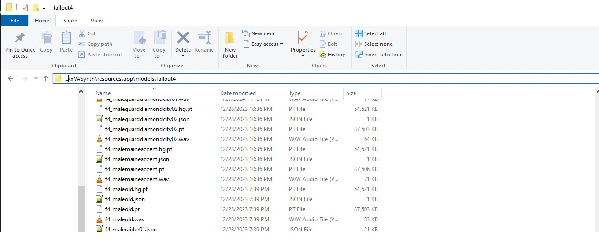
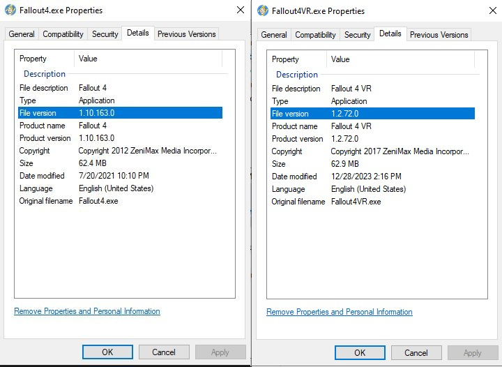
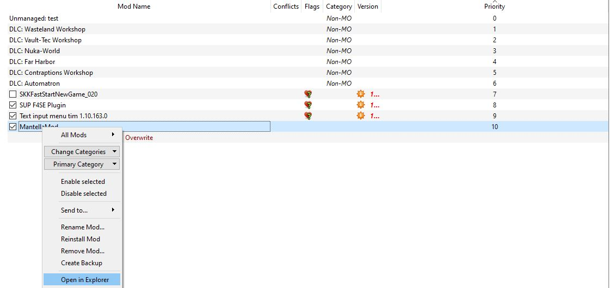
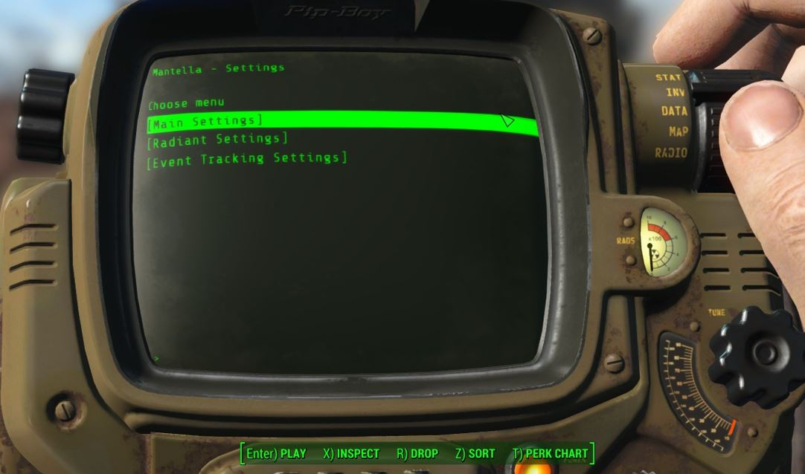

# Fallout 4 Installation
If you get stuck anywhere in the installation process, please see {doc}`/pages/issues_qna` or reach out on [Discord](https://discord.gg/Q4BJAdtGUE).

## Requirements
### Hardware Requirements
#### xVASynth
**CPU**  
xVASynth runs in CPU mode by default, using a single CPU core/thread. Generally, if you can already run Fallout 4, xVASynth should work with most CPU setups. 

<details>
<summary><b>GPU (Optional)</b></summary>  

NVIDIA cards that have CUDA can run xVASynth in GPU mode. Using the same GPU for both xVASynth and Fallout 4 may cause stutter.
</details>

### Storage Requirements
This mod requires ~16GB of space when xVASynth and all voice models are installed. 


### Compatibility
- [WARS - Weapon Addition and Replacement Suite](https://www.nexusmods.com/fallout4/mods/73478) conflicts with the Mantella Mod esp.
- Mantella requires **Windows 10 / 11** (it is yet unconfirmed whether it works on Windows 7)

### Fallout4
```{admonition} Warning
:class: attention

For Mantella to work properly you have to **enable archive invalidation** in your Fallout 4 ini file if you haven't already done so. See [here](https://www.nexusmods.com/fallout4/articles/3831) for instructions.
```

```{admonition} Warning
:class: attention

As Mantella accesses and writes to files within your Fallout 4 folder, it is unlikely to work correctly **if you have Fallout 4 stored in Program Files / (x86)**. Please ensure that you have Fallout 4 stored outside of this folder (eg `C:\Games\Steam`).
```

Steam does not allow to create a new Steam Game Library on the same disk. You can either move the whole Steam client outside [as described on this Steam Support page](https://help.steampowered.com/en/faqs/view/4BD4-4528-6B2E-8327) or use [LostDragonist/steam-library-setup-tool](https://github.com/LostDragonist/steam-library-setup-tool/wiki/Usage-Guide) to allow multiple Steam Game Libraries on one disk.

### Mantella Files
The Mantella files can be downloaded from [Nexus Mods](https://www.nexusmods.com/fallout4/mods/79747).

| File | Installation |
|----------|----------|
| [Mantella Software](https://www.nexusmods.com/skyrimspecialedition/mods/98631?tab=files) | Extract this folder somewhere convenient to you (if you need some inspiration, you can store it in Documents). **Do not store this folder in Program Files / (x86), Desktop, or your Fallout 4 folder**. |
| [Mantella Mod](https://www.nexusmods.com/fallout4/mods/79747?tab=files) | This file can be installed in the same way as other mods with your mod manager. |

## Text-to-Speech
Mantella can either be run with xVASynth or XTTS to generate the voicelines for NPCs. It is recommended to start with xVASynth because it is has lower hardware requirements than XTTS, but if you either have a powerful GPU / don't mind paying to run XTTS externally you can choose this option below.

<details>
	<summary><b>xVASynth</b></summary>  

1. Download xVASynth via [Steam](https://store.steampowered.com/app/1765720/xVASynth/) (preferred) or [Nexus](https://www.nexusmods.com/skyrimspecialedition/mods/44184?tab=files). Do not store xVASynth in your Fallout 4 game folder.

2. Download the Fallout 4 voice models. You can either download all models via the xVASynth UI if you have Nexus Premium, or manually via the [Nexus mods page](https://www.nexusmods.com/fallout4/mods/49340):  

	<br>
	<details>
	<summary><b>xVASynth Model Installation Options</b></summary>  

   	#### 💎 Nexus Premium (Quickest)  
   	If you are subscribed to Nexus Premium, (1.) open the xVASynth UI and select "Get More Voices" from the bottom left corner. (2.) Unselect all games except for Fallout 4, (3.) click "Check now" (you will be prompted to login to Nexus), then (4.) "Download All".
	  

	```{admonition} Note
	:class: seealso

	You may need to restart the download a few times for all voice models to properly download.  
	```
	#### 🌊 Torrent (Slowest, Easiest)  
   	Voice models can be downloaded via a single torrent. Torrents can be downloaded via Bittorent clients such as [qBittorent](https://www.qbittorrent.org/download). Note that download speeds vary depending on the time of day. Paste the below magnet link in your browser to receive a popup to open it via your Bittorent client, and set the download location to your_xVASynth_folder/resources/app/models/fallout4:  

   	`magnet:?xt=urn:btih:2ad8819bab72d25e5332baeae45d23412c04620a&dn=Fallout_4_XVASynth_Voices`  

	#### 🛠️ Manual  
   	If you do not have Nexus Premium, you can also download the voice models directly from Nexus [here](https://www.nexusmods.com/fallout4/mods/49340?tab=files) (under "Optional", not "Old"). Once you have manually downloaded each voice model into a folder, unzip the models manually into the correct xVASynth folder (`xVASynth\resources\app\models\fallout4`). Once the extraction is complete, you can delete the zipped voice model files.  
	The contents of `xVASynth\resources\app\models\fallout4` should look like the below:  
	

	```{admonition} Note
	:class: seealso

	If downloading all models sounds a bit daunting, you can start with the "Piper", "MaleEvenToned", "MaleBoston", "FemaleBoston" voice models to allow you to talk to most generic human NPCs.
	```
	  
	</details>
	<br>


4. Download the .lip plugin for xVASynth [here](https://www.nexusmods.com/skyrimspecialedition/mods/55605) and download FaceFXWrapper from [here](https://www.nexusmods.com/skyrimspecialedition/mods/20061) (you do not need to download CK64Fixes). Instructions on how to install these are on the .lip plugin Nexus page. Make sure to place FaceFXWrapper in the plugins folder as stated on the .lip plugin page.  
When installed correctly, it should look like the below:  


5. (Optional) Download the xVASynth DeepMoji Plugin [here](https://www.nexusmods.com/skyrimspecialedition/mods/107142). It boosts the emotionality of xVASynth voice models to make them sound less robotic (only available in English). Note that some Fallout 4 XVASynth voice models are older (<3.0) and for those the output will not be improved by use of the DeepMoji plugin.

6. (Optional) Download the xVASynth Punctuation Pitch Adjuster Plugin [here](https://bunglepaws.neocities.org/downloads/punctuation_pitch_adjuster_for_xvasynth.zip). It will add a high pitch tone at the final syllable for sentences that contain a question mark.
</details>
<br>

<details>
	<summary><b>XTTS</b></summary>  
	See here for MrHaurrus's tutorial on setting up XTTS, or read the instructions below:  
	<iframe width="560" height="315" src="https://www.youtube.com/embed/gvT0t87JVjo?si=Pvh3tSixieccuTwj" title="YouTube video player" frameborder="0" allow="accelerometer; autoplay; clipboard-write; encrypted-media; gyroscope; picture-in-picture; web-share" referrerpolicy="strict-origin-when-cross-origin" allowfullscreen></iframe>  
	<details>
		<summary><b>Local</b></summary> 

1. Download MrHaurrus's XTTS API server from [here](https://www.nexusmods.com/skyrimspecialedition/mods/113445?tab=files) and unzip it.

2. Download the [voice models (latents) folder](https://www.nexusmods.com/skyrimspecialedition/mods/113445?tab=files) called "english latent speaker for Fallout 4". Extract this folder into the same folder as `xtts-api-server-mantella.exe` above. In other words, you should have a folder called `latent_speaker_folder` in your XTTS folder.

3. Download the .lip plugin [here](https://www.nexusmods.com/skyrimspecialedition/mods/55605) and download FaceFXWrapper from [here](https://www.nexusmods.com/skyrimspecialedition/mods/20061) (you do not need to download CK64Fixes). Instructions on how to install these are on the .lip plugin Nexus page. Make sure to place FaceFXWrapper in the plugins folder as stated on the .lip plugin page.  

4. Set `xtts_server_folder` in MantellaSoftware/config.ini to the path of your new exe, and `tts_service` to "XTTS".

5. (Optional) Configure XTTS settings in the [Speech.Advanced] section of MantellaSoftware/config.ini. Note that if you are using an NVIDIA GPU, the `xtts_deepspeed` setting can improve response times by 2-4x if you also have `xtts_device` set to "cuda".

</details>  
<br>  
	<details>
	<summary><b>External (from $0.14/hr)</b></summary>  

1. Make a RunPod account ([https://www.runpod.io/](https://www.runpod.io/)) and add some credits ($10 minimum).

2. Follow [this link](https://runpod.io/console/gpu-cloud?template=x9ddee271u&ref=szjabwfp) to open the Mantella XTTS Pod. Choose a GPU to run the Pod with (if in doubt, choose the cheapest). Note that cheaper GPUs are available if you change the "Secure Cloud" setting to "Community Cloud".  


3. On the following two pages just click "Continue" and "Deploy" (you don't need to change any settings here).

4. Once the Pod is running, in your MantellaSoftware/config.ini set `tts_service` to "XTTS" and `xtts_url` to `https://{pod_id}-8020.proxy.runpod.net/`, with {pod-id} being the ID of the running Pod. Eg `https://a1b2c3d4qwerty-8020.proxy.runpod.net/`.  


5. It takes a few minutes for the Pod to start up, you can check the progress in Logs -> Container Logs from the Pod's dropdown menu. It will say "Uvicorn running" when it is ready.

6. When you are finished using Mantella, make sure to delete the Pod so that you are no longer charged! It only takes a few clicks to set up a new Pod so don't feel guilty about deleting it.
</details>  
</details>  

## Required Fallout 4 mods
```{admonition} Warning
:class: attention

Always ensure you are downloading the right version of each mod for your version of Fallout 4. You can check your Fallout 4 version by right-clicking its exe file in your Fallout 4. folder and going to Properties -> Details -> File version. it should be 1.10.163.0 (for Fallout 4 desktop) or 1.2.72.0 (for Fallout 4 VR).
```



Please follow the installation instructions on each of the linked pages:

**Fallout 4 Desktop**
| Mod | Notes |
|----------|----------|
| [F4SE](https://f4se.silverlock.org/) | Mandatory: Make sure to get the non VR version. Once installed, run f4se_loader.exe instead of Fallout4.exe. |
| [SUP F4SE](https://www.nexusmods.com/fallout4/mods/55419) | Mandatory: Needed to generate the files needed for Mantella to communicate with Fallout 4 |
| [Textinputmenu](https://www.nexusmods.com/fallout4/mods/27347) | Optional: Needed to access text input functions | 

**Fallout 4 VR**
| Mod | Notes |
|----------|----------|
| [F4SE](https://f4se.silverlock.org/) | Mandatory: Make sure to get the VR version. Once installed, run f4se_loader.exe instead of the Fallout4.exe. |
| [SUP F4SEVR](https://www.nexusmods.com/fallout4/mods/64420) | Mandatory: Needed to generate the files needed for Mantella to communicate with Fallout 4 |
| [Fallout 4 Version Check Patcher](https://www.nexusmods.com/fallout4/mods/42497?tab=description) | Mandatory: Needed for Fallout 4 VR to accept the mod |

## Language Models (LLMs)
LLMs power the creation of responses by NPCs. There are a number of different LLMs to choose from, ranging from free local models to large externally hosted models.

```{admonition} Note
:class: seealso

Some smaller models may struggle to handle long term conversations and memory summarising.
```

By default Mantella is set up to run with Toppy, a free and easy to use model hosted on OpenRouter. It is recommended to start with this model. To learn how to get started, see the OpenRouter section below.

### API Models
<details>
<summary><b>OpenRouter (Free Models Available)</b></summary>  

Create an account with OpenRouter. Go to the "Keys" tab and generate a new key, saving its value to `MantellaSoftware/GPT_SECRET_KEY.txt` (do not share this secret key with anyone). This is all you need to do to get started with Toppy, Mantella's default model.

While Toppy is a good model to get started with, it can fall short when trying to handle complex conversations, in-game lore, or long term memories. To try out a different model, in MantellaSoftware/config.ini set `model` to a model from the list [here](https://openrouter.ai/docs#models) (eg `undi95/toppy-m-7b`). Note that the majority of other models are not free, and you will need to add credits to your account to use them.
</details>
<br>

<details>
<summary><b>OpenAI</b></summary>  

Copy your OpenAI secret API key (see [here](https://help.openai.com/en/articles/4936850-where-do-i-find-my-secret-api-key) if you need help finding it (you will need to set up an account if you haven't already)) and paste into `MantellaSoftware/GPT_SECRET_KEY.txt`. Do not share this key with anyone. Note that you will need to set up your payment details for the API to work.
</details>
<br>

### Local Models
<details>
<summary><b>text-generation-webui</b></summary>  

1. Install the latest text-generation-webui .zip from [here](https://github.com/oobabooga/text-generation-webui/releases).  
  

2. Place a local model into the `text-generation-webui\models` folder (to get started, you can download `toppy-m-7b.Q4_K_S.gguf` from [here](https://huggingface.co/TheBloke/Toppy-M-7B-GGUF/tree/main?not-for-all-audiences=true)).  
  

3. Paste the text "--extensions openai --auto-launch" (as well as "--cpu" for CPU users) into the installed folder's CMD_FLAGS.txt file.  
  

4. Start text-generation-webui and wait for the UI to open in your web browser. Navigate to the "Model" tab, select your model from the drop-down list, and click "Load".  
  

```{admonition} Note
:class: seealso

Make sure text-generation-webui is running when Mantella is running! 
```
</details>
<br>
<details>
<summary><b>koboldcpp</b></summary>  

1. Install koboldcpp's latest release from [here](https://github.com/LostRuins/koboldcpp/releases). If you want to run koboldcpp on your CPU or otherwise do not have an NVIDIA GPU, download `koboldcpp_nocuda.exe` under "Assets". If you have an NVIDIA GPU with CUDA support, download `koboldcpp.exe` under "Assets".   
  

2. Download a local model, such as `toppy-m-7b.Q4_K_S.gguf` from [here](https://huggingface.co/TheBloke/Toppy-M-7B-GGUF/tree/main?not-for-all-audiences=true).  
  

3. Run koboldcpp.exe. When presented with the launch window, drag the "Context Size" slider to 4096. Click the "Browse" button next to the "Model" field and select the model you downloaded. Click "Launch" in the bottom right corner.  
  

```{admonition} Optional
:class: hint

Under the "Presets" drop down at the top, choose either Use CLBlast, or Use CuBlas (if using Cuda). You will then see a field for GPU Layers. If you want to use CPU only leave it at 0. If you want to use your GPU, you can experiment with how many "layers" to offload to your GPU based on your system.
```

```{admonition} Note
:class: seealso

Make sure koboldcpp is running when Mantella is running! 
```
</details>
<br>

### Other LLM Services
Mantella has the ability to support other language model services, although these services do need to support outputs in the OpenAI format (like text-generation-webui does via the "--extensions openai" option above).

## Whisper
<details>
<summary><b>Whisper via your CPU is handled automatically. Open this section only if you like tinkering</b></summary>  

guillaumekln's Faster-Whisper version of Whisper is used as Speech-To-Text engine by Mantella. The engine is **already part of the executable** and will download a chosen model automatically when launched. Uses a single CPU core by default when listening to the set default Windows microphone. Alternatively text input can be enabled by setting `microphone_enabled = 0` within MantellaSoftware/config.ini.

It is reasonably fast even in CPU mode with the base model. Optionally, to use GPU/CUDA mode, some extra files are required, see [Faster Whisper documentation](https://github.com/guillaumekln/faster-whisper#gpu). Note that cuBLAS may already be part of the CUDA Toolkit, so you may only require the `cudnn_###_infer64_8.dll` files to be beside the Mantella executable. Afterwards enable `process_device = cuda` under `[Microphone]` in MantellaSoftware/config.ini.
</details>

## Setup & Configuration
1. Set up the MantellaSoftware/config.ini file with your paths to Fallout (`fallout4_folder` or `fallout4VR_folder`), xVASynth (`xvasynth_folder`) / XTTS (`xtts_server_folder`), and the Mantella Fallout 4 mod (`fallout4_mod_folder` or `fallout4VR_mod_folder`). You will need to set `game` to `Fallout4` or `Fallout4VR` (be mindful of typing it as per the config.ini options). IMPORTANT: **You do not need to set the path for every game or mantella_mod, just the ones you plan to use.** 
	
	<br>
	<details>
	<summary><b>Mod Organizer 2 Users</b></summary>  

	- **fallout4_folder**  
	By default, this is simply the path to your Fallout 4 folder. If you are using a Wabbajack modlist, you may need to try searching for a folder called overwrite/root or "Stock Game" in your Mod Organizer 2 / Wabbajack installation path and set this as your `fallout4_folder` or `fallout4VR_folder` path.  

	- **mod_folder**  
	You can find the mod folder by right clicking the mod in the Mod Organizer 2 UI and selecting "Open in Explorer":  
	  
	</details>
	<br>
	<details>
	<summary><b>Vortex Users</b></summary>  

	- **fallout4_folder**  
	This is simply the path to your Fallout 4 folder.  

	- **mod_folder**  
	You need to point `mod_folder` to your Fallout 4/Data folder. So essentially, you need to take the Fallout 4 folder set in `fallout4_folder` or `fallout4VR_folder` and add "\Data" to the end of it. For example:  
	`mod_folder = C:\Steam\steamapps\common\Fallout 4\Data`  
	</details>
	<br>
2. Run Mantella.exe in MantellaSoftware. Once it does, it is ready for you to select an NPC in-game via the Mantella gun.  
  
```{admonition} Warning
:class: attention

Do not try to run Mantella.exe through Mod Organizer 2 / Vortex as it will not work correctly.
```

3. If you add a new unlisted NPC and for some reason the lip sync isn't happening in game you may need to close and reopen Fallout 4.

```{admonition} Note
:class: seealso

While there have not been issues reported with using Mantella in an existing save so far, please be aware that adding mods mid-game can cause problems.
```

The Mantella gun and settings holotape will be added to your inventory as soon as the exit from Vault 111 is complete. If you install the mod mid-game they should be dropped in your inventory as well (might require a cell change for the trigger to happen). The items can also be crafted at the Chem Station under UTILITY. You can end a conversation by simply saying / typing "goodbye". If the NPC responds with "safe travels" then the conversation has ended correctly via this latter method.  


## Other Tips
### Sound volume
Sound volume can be set by modifying the value for `FO4_NPC_response_volume` in MantellaSoftware/config.ini

### Text Input
Text input can be enabled by either setting `microphone_enabled = 0` in MantellaSoftware/config.ini. You can respond by text by using the 'H' hotkey. This can be changed in holotape settings by entering the  [DirectX scan code](https://falloutck.uesp.net/wiki/DirectX_Scan_Codes).

### Holotape
Many options can be modified in the holotape [Settings] Mantella Settings, such as NPC actions and radiant conversations.  
  

### NPCs not Found
If the NPC is unavailable to Mantella (most likely a modded NPC which you can add yourself via {doc}`/pages/adding_modded_npcs`), the message "Conversation ended." should immediately pop up in the top left corner and the conversation will exit. If the only message you see from the starting the conversation is "Conversation ended", please refer to the "Issues Q&A" section for common solutions to this. 

### Caching
Voicelines are cached in the `MantellaSoftware/data/voicelines/` folder. If this data takes up too much space over time, the contents of voicelines/ can be periodically deleted.

### Issues
If you are experiencing errors, please see {doc}`/pages/issues_qna`. Otherwise, please share the details of the errors and your MantellaSoftware/logging.log file on the Mantella Discord [#issues channel](https://discord.gg/Q4BJAdtGUE).